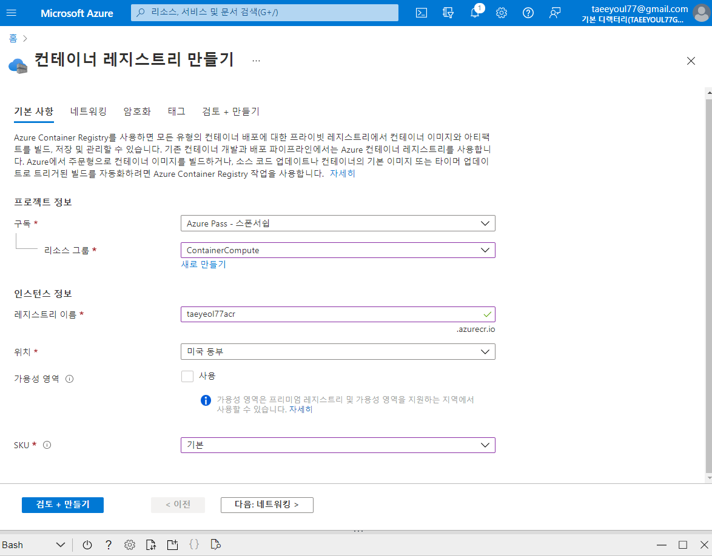
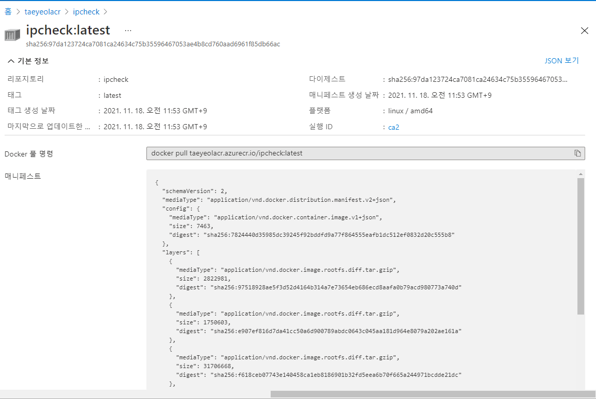
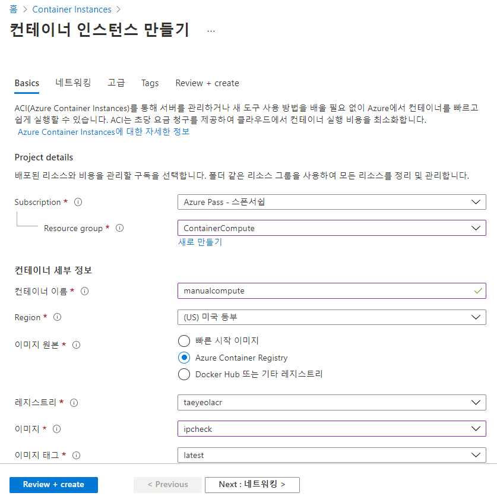

# Lab05.md

##  실습 1: AZURE CLI(명령줄 인터페이스)를 사용하여 VM 만들기
```
seo@Azure:~$ az vm create --resource-group ContainerCompute --name quickvm --image Debian --admin-username student --admin-password StudentPa55w.rd
It is recommended to use parameter "--public-ip-sku Standard" to create new VM with Standard public IP. Please note that the default public IP used for VM creation will be changed from Basic to Standard in the future.
{
  "fqdns": "",
  "id": "/subscriptions/0aa01477-9ad1-4549-bacf-eac6035fa242/resourceGroups/ContainerCompute/providers/Microsoft.Compute/virtualMachines/quickvm",
  "location": "eastus",
  "macAddress": "00-22-48-27-8B-61",
  "powerState": "VM running",
  "privateIpAddress": "10.0.0.4",
  "publicIpAddress": "40.80.146.53",
  "resourceGroup": "ContainerCompute",
  "zones": ""
}
seo@Azure:~$
```
### 새로 만든 VM에 대한 다양한 메타데이터를 포함하는 상세한 JSON(JavaScript Object Notation) 파일을 가져옵니다.
```
seo@Azure:~$ az vm show --resource-group ContainerCompute --name quickvm
{
  "additionalCapabilities": null,
  "applicationProfile": null,
  "availabilitySet": null,
  "billingProfile": null,
  "capacityReservation": null,
  "diagnosticsProfile": null,
  "evictionPolicy": null,
  "extendedLocation": null,
  "extensionsTimeBudget": null,
  "hardwareProfile": {
    "vmSize": "Standard_DS1_v2",
    "vmSizeProperties": null
  },
  "host": null,
  "hostGroup": null,
  "id": "/subscriptions/0aa01477-9ad1-4549-bacf-eac6035fa242/resourceGroups/ContainerCompute/providers/Microsoft.Compute/virtualMachines/quickvm",
  "identity": null,
  "instanceView": null,
  "licenseType": null,
  "location": "eastus",
  "name": "quickvm",
  "networkProfile": {
    "networkApiVersion": null,
    "networkInterfaceConfigurations": null,
    "networkInterfaces": [
      {
        "deleteOption": null,
        "id": "/subscriptions/0aa01477-9ad1-4549-bacf-eac6035fa242/resourceGroups/ContainerCompute/providers/Microsoft.Network/networkInterfaces/quickvmVMNic",
        "primary": null,
        "resourceGroup": "ContainerCompute"
      }
    ]
  },
  "osProfile": {
    "adminPassword": null,
    "adminUsername": "student",
    "allowExtensionOperations": true,
    "computerName": "quickvm",
    "customData": null,
    "linuxConfiguration": {
      "disablePasswordAuthentication": false,
      "patchSettings": {
        "assessmentMode": "ImageDefault",
        "patchMode": "ImageDefault"
      },
      "provisionVmAgent": true,
      "ssh": null
    },
    "requireGuestProvisionSignal": true,
    "secrets": [],
    "windowsConfiguration": null
  },
  "plan": null,
  "platformFaultDomain": null,
  "priority": null,
  "provisioningState": "Succeeded",
  "proximityPlacementGroup": null,
  "resourceGroup": "ContainerCompute",
  "resources": null,
  "scheduledEventsProfile": null,
  "securityProfile": null,
  "storageProfile": {
    "dataDisks": [],
    "imageReference": {
      "exactVersion": "0.20211011.792",
      "id": null,
      "offer": "debian-10",
      "publisher": "Debian",
      "sharedGalleryImageId": null,
      "sku": "10",
      "version": "latest"
    },
    "osDisk": {
      "caching": "ReadWrite",
      "createOption": "FromImage",
      "deleteOption": "Detach",
      "diffDiskSettings": null,
      "diskSizeGb": 30,
      "encryptionSettings": null,
      "image": null,
      "managedDisk": {
        "diskEncryptionSet": null,
        "id": "/subscriptions/0aa01477-9ad1-4549-bacf-eac6035fa242/resourceGroups/ContainerCompute/providers/Microsoft.Compute/disks/quickvm_disk1_49752931cda042f2ac45a57086bbc572",
        "resourceGroup": "ContainerCompute",
        "storageAccountType": "Premium_LRS"
      },
      "name": "quickvm_disk1_49752931cda042f2ac45a57086bbc572",
      "osType": "Linux",
      "vhd": null,
      "writeAcceleratorEnabled": null
    }
  },
  "tags": {},
  "type": "Microsoft.Compute/virtualMachines",
  "userData": null,
  "virtualMachineScaleSet": null,
  "vmId": "fcf6a18a-23e8-45a8-be2d-af11c44f38db",
  "zones": null
}
seo@Azure:~$
```
### VM과 연결된 모든 IP 주소를 나열합니다.
```
seo@Azure:~$ az vm list-ip-addresses --resource-group ContainerCompute --name quickvm
[
  {
    "virtualMachine": {
      "name": "quickvm",
      "network": {
        "privateIpAddresses": [
          "10.0.0.4"
        ],
        "publicIpAddresses": [
          {
            "id": "/subscriptions/0aa01477-9ad1-4549-bacf-eac6035fa242/resourceGroups/ContainerCompute/providers/Microsoft.Network/publicIPAddresses/quickvmPublicIP",
            "ipAddress": "40.80.146.53",
            "ipAllocationMethod": "Dynamic",
            "name": "quickvmPublicIP",
            "resourceGroup": "ContainerCompute"
          }
        ]
      },
      "resourceGroup": "ContainerCompute"
    }
  }
]
seo@Azure:~$
```

### 출력을 필터링하고 첫 번째 IP 주소 값만 반환합니다.
```
seo@Azure:~$ az vm list-ip-addresses --resource-group ContainerCompute --name quickvm --query '[].{ip:virtualMachine.network.publicIpAddresses[0].ipAddress}' --output tsv

40.80.146.53
seo@Azure:~$
```

### ipAddress라는 새 Bash 셸 변수에 이전 명령의 결과를 저장합니다.
```
seo@Azure:~$ ipAddress=$(az vm list-ip-addresses --resource-group ContainerCompute --name quickvm --query '[].{ip:virtualMachine.network.publicIpAddresses[0].ipAddress}' --output tsv)

seo@Azure:~$ echo $ipAddress
40.80.146.53
seo@Azure:~$
```

###  SSH(Secure Shell) 도구 및 Bash 셸 변수 ipAddress에 저장된 IP 주소를 사용하여 이전에 랩에서 만든 VM에 연결합니다.
- password : StudentPa55w.rd
```
seo@Azure:~$ ssh student@$ipAddress
The authenticity of host '40.80.146.53 (40.80.146.53)' can't be established.
ECDSA key fingerprint is SHA256:I+wYfW//E55IXoAp1rbEBqWk5jn0nddQqJUdwa+wzlM.
Are you sure you want to continue connecting (yes/no)? yes
Warning: Permanently added '40.80.146.53' (ECDSA) to the list of known hosts.
student@40.80.146.53's password:
Linux quickvm 4.19.0-18-cloud-amd64 #1 SMP Debian 4.19.208-1 (2021-09-29) x86_64

The programs included with the Debian GNU/Linux system are free software;
the exact distribution terms for each program are described in the
individual files in /usr/share/doc/*/copyright.

Debian GNU/Linux comes with ABSOLUTELY NO WARRANTY, to the extent
permitted by applicable law.
student@quickvm:~$ uname -a
Linux quickvm 4.19.0-18-cloud-amd64 #1 SMP Debian 4.19.208-1 (2021-09-29) x86_64 GNU/Linux
student@quickvm:~$ exit
logout
Connection to 40.80.146.53 closed.
seo@Azure:~$
```

## 연습 2: Docker 컨테이너 이미지를 만들고 Azure Container Registry에 배포합니다.
```
seo@Azure:~$ cd ~/clouddrive
seo@Azure:~/clouddrive$ ls -lt
total 0
seo@Azure:~/clouddrive$ mkdir ipcheck
seo@Azure:~/clouddrive$ cd ~/clouddrive/ipcheck
seo@Azure:~/clouddrive/ipcheck$ dotnet new console --output . --name ipcheck

Welcome to .NET Core 3.1!
---------------------
SDK Version: 3.1.403

Telemetry
---------
The .NET Core tools collect usage data in order to help us improve your experience. The data is anonymous. It is collected by Microsoft and shared with the community. You can opt-out of telemetry by setting the DOTNET_CLI_TELEMETRY_OPTOUT environment variable to '1' or 'true' using your favorite shell.

Read more about .NET Core CLI Tools telemetry: https://aka.ms/dotnet-cli-telemetry

----------------
Explore documentation: https://aka.ms/dotnet-docs
Report issues and find source on GitHub: https://github.com/dotnet/core
Find out what's new: https://aka.ms/dotnet-whats-new
Learn about the installed HTTPS developer cert: https://aka.ms/aspnet-core-https
Use 'dotnet --help' to see available commands or visit: https://aka.ms/dotnet-cli-docs
Write your first app: https://aka.ms/first-net-core-app
--------------------------------------------------------------------------------------
Getting ready...
The template "Console Application" was created successfully.

Processing post-creation actions...
Running 'dotnet restore' on ./ipcheck.csproj...
  Determining projects to restore...
  Restored /usr/csuser/clouddrive/ipcheck/ipcheck.csproj (in 139 ms).

Restore succeeded.

seo@Azure:~/clouddrive/ipcheck$ touch Dockerfile
seo@Azure:~/clouddrive/ipcheck$ code .
seo@Azure:~/clouddrive/ipcheck$ dotnet run
Current IP Addresses:
        10.244.142.252
```
```c#
public class Program
{
    public static void Main(string[] args)
    {        
        // Check if network is available
        if (System.Net.NetworkInformation.NetworkInterface.GetIsNetworkAvailable())
        {
            System.Console.WriteLine("Current IP Addresses:");

            // Get host entry for current hostname
            string hostname = System.Net.Dns.GetHostName();
            System.Net.IPHostEntry host = System.Net.Dns.GetHostEntry(hostname);
            
            // Iterate over each IP address and render their values
            foreach(System.Net.IPAddress address in host.AddressList)
            {
                System.Console.WriteLine($"\t{address}");
            }
        }
        else
        {
            System.Console.WriteLine("No Network Connection");
        }
    }
}
```
```Dockerfile
# Start using the .NET Core 3.1 SDK container image
FROM mcr.microsoft.com/dotnet/sdk:3.1-alpine AS build

# Change current working directory
WORKDIR /app

# Copy existing files from host machine
COPY . ./

# Publish application to the "out" folder
RUN dotnet publish --configuration Release --output out

# Start container by running application DLL
ENTRYPOINT ["dotnet", "out/ipcheck.dll"]
```

### 작업 3: Container Registry 리소스 만들기 - taeyeol77 (기본, 미국동부)

### 작업 4: Azure Cloud Shell 열기 및 컨테이너 레지스트리 메타데이터 저장
```
seo@Azure:~/clouddrive/ipcheck$ az acr list
[
  {
    "adminUserEnabled": true,
    "anonymousPullEnabled": false,
    "creationDate": "2021-11-18T01:59:55.483328+00:00",
    "dataEndpointEnabled": false,
    "dataEndpointHostNames": [],
    "encryption": {
      "keyVaultProperties": null,
      "status": "disabled"
    },
    "id": "/subscriptions/0aa01477-9ad1-4549-bacf-eac6035fa242/resourceGroups/taeyeolrg/providers/Microsoft.ContainerRegistry/registries/taeyeolacr",
    "identity": null,
    "location": "eastus",
    "loginServer": "taeyeolacr.azurecr.io",
    "name": "taeyeolacr",
    "networkRuleBypassOptions": "AzureServices",
    "networkRuleSet": null,
    "policies": {
      "exportPolicy": {
        "status": "enabled"
      },
      "quarantinePolicy": {
        "status": "disabled"
      },
      "retentionPolicy": {
        "days": 7,
        "lastUpdatedTime": "2021-11-18T01:59:57.832597+00:00",
        "status": "disabled"
      },
      "trustPolicy": {
        "status": "disabled",
        "type": "Notary"
      }
    },
    "privateEndpointConnections": [],
    "provisioningState": "Succeeded",
    "publicNetworkAccess": "Enabled",
    "resourceGroup": "taeyeolrg",
    "sku": {
      "name": "Basic",
      "tier": "Basic"
    },
    "status": null,
    "systemData": {
      "createdAt": "2021-11-18T01:59:55.483328+00:00",
      "createdBy": "taeeyoul77@gmail.com",
      "createdByType": "User",
      "lastModifiedAt": "2021-11-18T02:00:42.872722+00:00",
      "lastModifiedBy": "taeeyoul77@gmail.com",
      "lastModifiedByType": "User"
    },
    "tags": {},
    "type": "Microsoft.ContainerRegistry/registries",
    "zoneRedundancy": "Disabled"
  }
]
seo@Azure:~/clouddrive/ipcheck$ az acr list --query "max_by([], &creationDate).name" --output tsv
taeyeolacr
seo@Azure:~/clouddrive/ipcheck$ acrName=$(az acr list --query "max_by([], &creationDate).name" --output tsv)

seo@Azure:~/clouddrive/ipcheck$ echo acrName
acrName
```

### 작업 5: 컨테이너 레지스트리에 Docker 컨테이너 이미지를 배포합니다.
```
seo@Azure:~/clouddrive/ipcheck$ dir
bin  Dockerfile  ipcheck.csproj  obj  Program.cs
seo@Azure:~/clouddrive/ipcheck$ az acr build --registry $acrName --image ipcheck:latest .

Packing source code into tar to upload...
Uploading archived source code from '/tmp/build_archive_e5e0efc26aa44b94bd3ea4293ef3aa6d.tar.gz'...
Sending context (99.789 KiB) to registry: taeyeolacr...
Queued a build with ID: ca2
Waiting for an agent...
2021/11/18 02:53:08 Downloading source code...
2021/11/18 02:53:09 Finished downloading source code
2021/11/18 02:53:10 Using acb_vol_f5b7c821-3eda-42b4-a5c2-dafe47df797d as the home volume
2021/11/18 02:53:10 Setting up Docker configuration...
2021/11/18 02:53:11 Successfully set up Docker configuration
2021/11/18 02:53:11 Logging in to registry: taeyeolacr.azurecr.io
2021/11/18 02:53:14 Successfully logged into taeyeolacr.azurecr.io
2021/11/18 02:53:14 Executing step ID: build. Timeout(sec): 28800, Working directory: '', Network: ''
2021/11/18 02:53:14 Scanning for dependencies...
2021/11/18 02:53:14 Successfully scanned dependencies
2021/11/18 02:53:14 Launching container with name: build
Sending build context to Docker daemon  326.7kB
Step 1/5 : FROM mcr.microsoft.com/dotnet/sdk:3.1-alpine AS build
3.1-alpine: Pulling from dotnet/sdk
97518928ae5f: Pulling fs layer
e907ef816d7d: Pulling fs layer
f618ceb07743: Pulling fs layer
822dc8ba0922: Pulling fs layer
57caf75e4d33: Pulling fs layer
500ae5964c52: Pulling fs layer
3fba8a0a14e2: Pulling fs layer
822dc8ba0922: Waiting
57caf75e4d33: Waiting
500ae5964c52: Waiting
3fba8a0a14e2: Waiting
e907ef816d7d: Verifying Checksum
e907ef816d7d: Download complete
97518928ae5f: Verifying Checksum
97518928ae5f: Download complete
822dc8ba0922: Verifying Checksum
822dc8ba0922: Download complete
f618ceb07743: Verifying Checksum
f618ceb07743: Download complete
57caf75e4d33: Verifying Checksum
57caf75e4d33: Download complete
97518928ae5f: Pull complete
3fba8a0a14e2: Verifying Checksum
3fba8a0a14e2: Download complete
e907ef816d7d: Pull complete
500ae5964c52: Verifying Checksum
500ae5964c52: Download complete
f618ceb07743: Pull complete
822dc8ba0922: Pull complete
57caf75e4d33: Pull complete
500ae5964c52: Pull complete
3fba8a0a14e2: Pull complete
Digest: sha256:4b67310ae43d207e153c68e4982e4dfd3f86582ade7fbd6358337e3629eb5ea9
Status: Downloaded newer image for mcr.microsoft.com/dotnet/sdk:3.1-alpine
 ---> f8137823667a
Step 2/5 : WORKDIR /app
 ---> Running in b057c384a0ca
Removing intermediate container b057c384a0ca
 ---> f1c6af9cbe59
Step 3/5 : COPY . ./
 ---> 6d51b4d080b6
Step 4/5 : RUN dotnet publish --configuration Release --output out
 ---> Running in 9af518c680a4
Microsoft (R) Build Engine version 16.7.2+b60ddb6f4 for .NET
Copyright (C) Microsoft Corporation. All rights reserved.

  Determining projects to restore...
  Restored /app/ipcheck.csproj (in 163 ms).
  ipcheck -> /app/bin/Release/netcoreapp3.1/ipcheck.dll
  ipcheck -> /app/out/
Removing intermediate container 9af518c680a4
 ---> fbe3f75131ca
Step 5/5 : ENTRYPOINT ["dotnet", "out/ipcheck.dll"]
 ---> Running in 2e58664c39af
Removing intermediate container 2e58664c39af
 ---> 7824440d3598
Successfully built 7824440d3598
Successfully tagged taeyeolacr.azurecr.io/ipcheck:latest
2021/11/18 02:53:29 Successfully executed container: build
2021/11/18 02:53:29 Executing step ID: push. Timeout(sec): 3600, Working directory: '', Network: ''
2021/11/18 02:53:29 Pushing image: taeyeolacr.azurecr.io/ipcheck:latest, attempt 1
The push refers to repository [taeyeolacr.azurecr.io/ipcheck]
3aa83d05eff0: Preparing
99bfdb8c467a: Preparing
0a85c1bb2850: Preparing
f1ae15bd0bbf: Preparing
21228e20fd45: Preparing
e7f3a967e06c: Preparing
6c9241ef62e3: Preparing
5cb2eb97af77: Preparing
98bc857b3aed: Preparing
1a058d5342cc: Preparing
e7f3a967e06c: Waiting
6c9241ef62e3: Waiting
5cb2eb97af77: Waiting
98bc857b3aed: Waiting
1a058d5342cc: Waiting
0a85c1bb2850: Pushed
3aa83d05eff0: Pushed
99bfdb8c467a: Pushed
f1ae15bd0bbf: Pushed
6c9241ef62e3: Pushed
e7f3a967e06c: Pushed
98bc857b3aed: Pushed
1a058d5342cc: Pushed
5cb2eb97af77: Pushed
21228e20fd45: Pushed
latest: digest: sha256:97da123724ca7081ca24634c75b35596467053ae4b8cd760aad6961f85db66ac size: 2424
2021/11/18 02:53:45 Successfully pushed image: taeyeolacr.azurecr.io/ipcheck:latest
2021/11/18 02:53:45 Step ID: build marked as successful (elapsed time in seconds: 15.029242)
2021/11/18 02:53:45 Populating digests for step ID: build...
2021/11/18 02:53:46 Successfully populated digests for step ID: build
2021/11/18 02:53:46 Step ID: push marked as successful (elapsed time in seconds: 16.228847)
2021/11/18 02:53:46 The following dependencies were found:
2021/11/18 02:53:46
- image:
    registry: taeyeolacr.azurecr.io
    repository: ipcheck
    tag: latest
    digest: sha256:97da123724ca7081ca24634c75b35596467053ae4b8cd760aad6961f85db66ac
  runtime-dependency:
    registry: mcr.microsoft.com
    repository: dotnet/sdk
    tag: 3.1-alpine
    digest: sha256:4b67310ae43d207e153c68e4982e4dfd3f86582ade7fbd6358337e3629eb5ea9
  git: {}

Run ID: ca2 was successful after 38s
seo@Azure:~/clouddrive/ipcheck$
```

```ipcheck.csproj
<Project Sdk="Microsoft.NET.Sdk">

  <PropertyGroup>
    <OutputType>Exe</OutputType>
    <TargetFramework>netcoreapp3.1</TargetFramework>
  </PropertyGroup>

</Project>
```

```Program.cs
using System;

namespace ipcheck
{
  public class Program
  {
    public static void Main(string[] args)
    {
        // Check if network is available
        if (System.Net.NetworkInformation.NetworkInterface.GetIsNetworkAvailable())
        {
            System.Console.WriteLine("Current IP Addresses:");

            // Get host entry for current hostname
            string hostname = System.Net.Dns.GetHostName();
            System.Net.IPHostEntry host = System.Net.Dns.GetHostEntry(hostname);

            // Iterate over each IP address and render their values
            foreach(System.Net.IPAddress address in host.AddressList)
            {
                System.Console.WriteLine($"\t{address}");
            }
        }
        else
        {
            System.Console.WriteLine("No Network Connection");
        }
    }
  }
}
```

```Dockerfile
# Start using the .NET Core 3.1 SDK container image
FROM mcr.microsoft.com/dotnet/sdk:3.1-alpine AS build

# Change current working directory
WORKDIR /app

# Copy existing files from host machine
COPY . ./

# Publish application to the "out" folder
RUN dotnet publish --configuration Release --output out

# Start container by running application DLL
ENTRYPOINT ["dotnet", "out/ipcheck.dll"]
```

### 6: 컨테이너 레지스트리의 컨테이너 이미지 유효성 검사



## 연습 3: Azure Container Instance 배포
### 


## 연습 4: 구독 정리
```
az group delete --name ContainerCompute --no-wait --yes
```
