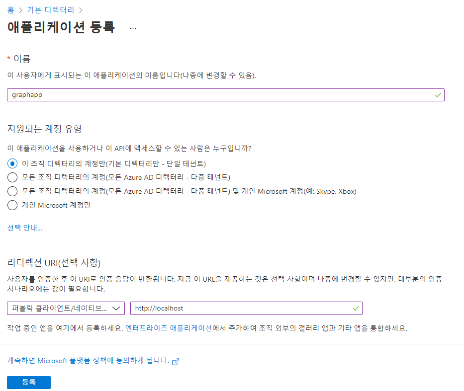
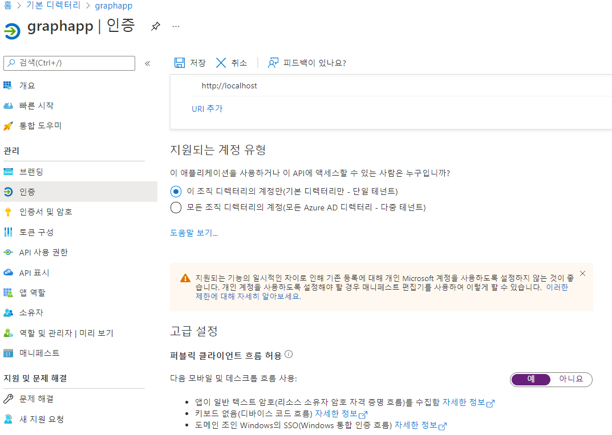
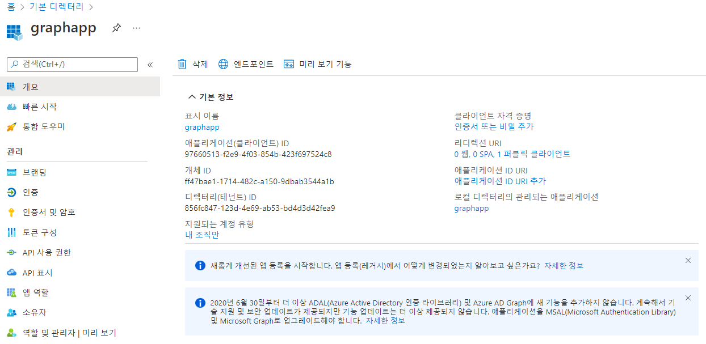

# 랩 06: MSAL 및 .NET SDK를 사용하여 Microsoft Graph 인증 및 쿼리

## 실습 1: Azure Active Directory(Azure AD) 애플리케이션 등록 만들기
### 작업 2: 애플리케이션 등록 만들기
- Azure Active Directory > 관리 > 앱등록  
  

### 작업 3: 기본 클라이언트 유형 사용
graphapp > 관리 > 인증


### 작업 4: 고유 식별자 기록
- 애플리케이션(클라이언트) ID :  97660513-f2e9-4f03-854b-423f697524c8
- 디렉터리(테넌트) ID : 856fc847-123d-4e69-ab53-bd4d3d42fea9
  

## 연습 2: MSAL.NET 라이브러리를 사용하여 토큰을 가져옵니다.
```
PS D:\workspace\AZ204\AZ-204KO-DevelopingSolutionsforMicrosoftAzure\Allfiles\Labs\06\Starter> cd GraphClient
dotnet new console --name GraphClient --output .
dotnet add package Microsoft.Identity.Client --version 4.7.1
dotnet build
```
### 작업 1: .NET 프로젝트 만들기
#### 1. GraphClient이라는 새 .NET Core 콘솔 애플리케이션을 만듦  
```
PS D:\workspace\AZ204\AZ-204KO-DevelopingSolutionsforMicrosoftAzure\Allfiles\Labs\06\Starter\GraphClient> dotnet new console --name GraphClient --output .
"콘솔 앱" 템플릿이 성공적으로 생성되었습니다.

생성 후 작업 처리 중...
D:\workspace\AZ204\AZ-204KO-DevelopingSolutionsforMicrosoftAzure\Allfiles\Labs\06\Starter\GraphClient\GraphClient.csproj에서 'dotnet restore' 실행 중 ...
  복원할 프로젝트를 확인하는 중...
  D:\workspace\AZ204\AZ-204KO-DevelopingSolutionsforMicrosoftAzure\Allfiles\Labs\06\Starter\GraphClient\GraphClient.csproj을(를) 128 ms 동안 복원했습니다.
복원에 성공했습니다.

PS D:\workspace\AZ204\AZ-204KO-DevelopingSolutionsforMicrosoftAzure\Allfiles\Labs\06\Starter\GraphClient>
```

#### NuGet에서 Microsoft.Identity.Client의 버전 4.7.1을 가져옴
- dotnet add package Microsoft.Identity.Client --version 4.7.1
```
  복원할 프로젝트를 확인하는 중...
  Writing C:\Users\Administrator\AppData\Local\Temp\tmp9B04.tmp
info : 'D:\workspace\AZ204\AZ-204KO-DevelopingSolutionsforMicrosoftAzure\Allfiles\Labs\06\Starter\GraphClient\GraphClient.csproj' 프로젝트에 'Microsoft.Identity.Client' 패키지에 대한
 PackageReference를 추가하는 중입니다.
info : D:\workspace\AZ204\AZ-204KO-DevelopingSolutionsforMicrosoftAzure\Allfiles\Labs\06\Starter\GraphClient\GraphClient.csproj의 패키지를 복원하는 중...
info :   GET https://api.nuget.org/v3-flatcontainer/microsoft.identity.client/index.json
info :   OK https://api.nuget.org/v3-flatcontainer/microsoft.identity.client/index.json 722밀리초
info :   GET https://api.nuget.org/v3-flatcontainer/microsoft.identity.client/4.7.1/microsoft.identity.client.4.7.1.nupkg
info :   OK https://api.nuget.org/v3-flatcontainer/microsoft.identity.client/4.7.1/microsoft.identity.client.4.7.1.nupkg 41밀리초
info :   GET https://api.nuget.org/v3-flatcontainer/system.net.nameresolution/index.json
info :   GET https://api.nuget.org/v3-flatcontainer/system.private.uri/index.json
info :   GET https://api.nuget.org/v3-flatcontainer/system.runtime.serialization.json/index.json
info :   GET https://api.nuget.org/v3-flatcontainer/system.security.securestring/index.json
info :   OK https://api.nuget.org/v3-flatcontainer/system.private.uri/index.json 298밀리초
info :   GET https://api.nuget.org/v3-flatcontainer/system.private.uri/4.3.2/system.private.uri.4.3.2.nupkg
info :   OK https://api.nuget.org/v3-flatcontainer/system.runtime.serialization.json/index.json 313밀리초
info :   GET https://api.nuget.org/v3-flatcontainer/system.runtime.serialization.json/4.3.0/system.runtime.serialization.json.4.3.0.nupkg
info :   OK https://api.nuget.org/v3-flatcontainer/system.security.securestring/index.json 316밀리초
info :   OK https://api.nuget.org/v3-flatcontainer/system.private.uri/4.3.2/system.private.uri.4.3.2.nupkg 32밀리초
info :   GET https://api.nuget.org/v3-flatcontainer/system.security.securestring/4.3.0/system.security.securestring.4.3.0.nupkg
info :   OK https://api.nuget.org/v3-flatcontainer/system.runtime.serialization.json/4.3.0/system.runtime.serialization.json.4.3.0.nupkg 37밀리초
info :   GET https://api.nuget.org/v3-flatcontainer/microsoft.netcore.platforms/index.json
info :   OK https://api.nuget.org/v3-flatcontainer/system.security.securestring/4.3.0/system.security.securestring.4.3.0.nupkg 38밀리초
info :   GET https://api.nuget.org/v3-flatcontainer/microsoft.netcore.targets/index.json
info :   GET https://api.nuget.org/v3-flatcontainer/system.private.datacontractserialization/index.json
info :   OK https://api.nuget.org/v3-flatcontainer/microsoft.netcore.platforms/index.json 202밀리초
info :   GET https://api.nuget.org/v3-flatcontainer/microsoft.netcore.platforms/1.1.1/microsoft.netcore.platforms.1.1.1.nupkg
info :   OK https://api.nuget.org/v3-flatcontainer/microsoft.netcore.platforms/1.1.1/microsoft.netcore.platforms.1.1.1.nupkg 32밀리초
info :   OK https://api.nuget.org/v3-flatcontainer/microsoft.netcore.targets/index.json 318밀리초
info :   GET https://api.nuget.org/v3-flatcontainer/microsoft.netcore.targets/1.1.3/microsoft.netcore.targets.1.1.3.nupkg
info :   OK https://api.nuget.org/v3-flatcontainer/system.net.nameresolution/index.json 735밀리초
info :   GET https://api.nuget.org/v3-flatcontainer/system.net.nameresolution/4.3.0/system.net.nameresolution.4.3.0.nupkg
info :   OK https://api.nuget.org/v3-flatcontainer/microsoft.netcore.targets/1.1.3/microsoft.netcore.targets.1.1.3.nupkg 39밀리초
info :   OK https://api.nuget.org/v3-flatcontainer/system.net.nameresolution/4.3.0/system.net.nameresolution.4.3.0.nupkg 40밀리초
info :   GET https://api.nuget.org/v3-flatcontainer/system.security.principal.windows/index.json
info :   OK https://api.nuget.org/v3-flatcontainer/system.security.principal.windows/index.json 211밀리초
info :   GET https://api.nuget.org/v3-flatcontainer/system.security.principal.windows/4.3.0/system.security.principal.windows.4.3.0.nupkg
info :   OK https://api.nuget.org/v3-flatcontainer/system.security.principal.windows/4.3.0/system.security.principal.windows.4.3.0.nupkg 41밀리초
info :   OK https://api.nuget.org/v3-flatcontainer/system.private.datacontractserialization/index.json 742밀리초
info :   GET https://api.nuget.org/v3-flatcontainer/system.private.datacontractserialization/4.3.0/system.private.datacontractserialization.4.3.0.nupkg
info :   OK https://api.nuget.org/v3-flatcontainer/system.private.datacontractserialization/4.3.0/system.private.datacontractserialization.4.3.0.nupkg 36밀리초
info :   GET https://api.nuget.org/v3-flatcontainer/system.xml.xmlserializer/index.json
info :   OK https://api.nuget.org/v3-flatcontainer/system.xml.xmlserializer/index.json 730밀리초
info :   GET https://api.nuget.org/v3-flatcontainer/system.xml.xmlserializer/4.3.0/system.xml.xmlserializer.4.3.0.nupkg
info :   OK https://api.nuget.org/v3-flatcontainer/system.xml.xmlserializer/4.3.0/system.xml.xmlserializer.4.3.0.nupkg 36밀리초
info : 콘텐츠 해시 o1+7RJnu3Ik3PazR7Z7tJhjPdE000Eq2KGLLWhqJJKXj04wrS8lwb1OFtDF9jzXXADhUuZNJZlPc98uwwqmpFA==을(를) 사용하여 https://api.nuget.org/v3/index.json에서 System.Private.Uri 
4.3.2을(를) 설치했습니다.
info : 콘텐츠 해시 3Wrmi0kJDzClwAC+iBdUBpEKmEle8FQNsCs77fkiOIw/9oYA07bL1EZNX0kQ2OMN3xpwvl0vAtOCYY3ndDNlhQ==을(를) 사용하여 https://api.nuget.org/v3/index.json에서 Microsoft.NETCore.Targets 1.1.3을(를) 설치했습니다.
info : 콘텐츠 해시 TMBuzAHpTenGbGgk0SMTwyEkyijY/Eae4ZGsFNYJvAr/LDn1ku3Etp3FPxChmDp5HHF3kzJuoaa08N0xjqAJfQ==을(를) 사용하여 https://api.nuget.org/v3/index.json에서 Microsoft.NETCore.Platforms 1.1.1을(를) 설치했습니다.
info : 콘텐츠 해시 yDaJ2x3mMmjdZEDB4IbezSnCsnjQ4BxinKhRAaP6kEgL6Bb6jANWphs5SzyD8imqeC/3FxgsuXT6ykkiH1uUmA==을(를) 사용하여 https://api.nuget.org/v3/index.json에서 System.Private.DataContractSerialization 4.3.0을(를) 설치했습니다.
info : 콘텐츠 해시 HVL1rvqYtnRCxFsYag/2le/ZfKLK4yMw79+s6FmKXbSCNN0JeAhrYxnRAHFoWRa0dEojsDcbBSpH3l22QxAVyw==을(를) 사용하여 https://api.nuget.org/v3/index.json에서 System.Security.Principal.Windows 4.3.0을(를) 설치했습니다.
info : 콘텐츠 해시 PnXp38O9q/2Oe4iZHMH60kinScv6QiiL2XH54Pj2t0Y6c2zKPEiAZsM/M3wBOHLNTBDFP0zfy13WN2M0qFz5jg==을(를) 사용하여 https://api.nuget.org/v3/index.json에서 System.Security.SecureString 4.3.0을(를) 설치했습니다.
info : 콘텐츠 해시 AFYl08R7MrsrEjqpQWTZWBadqXyTzNDaWpMqyxhb0d6sGhV6xMDKueuBXlLL30gz+DIRY6MpdgnHWlCh5wmq9w==을(를) 사용하여 https://api.nuget.org/v3/index.json에서 System.Net.NameResolution 4.3.0을(를) 설치했습니다.
info : 콘텐츠 해시 CpVfOH0M/uZ5PH+M9+Gu56K0j9lJw3M+PKRegTkcrY/stOIvRUeonggxNrfBYLA5WOHL2j15KNJuTuld3x4o9w==을(를) 사용하여 https://api.nuget.org/v3/index.json에서 System.Runtime.Serialization.Json 4.3.0을(를) 설치했습니다.
info : 콘텐츠 해시 MYoTCP7EZ98RrANESW05J5ZwskKDoN0AuZ06ZflnowE50LTpbR5yRg3tHckTVm5j/m47stuGgCrCHWePyHS70Q==을(를) 사용하여 https://api.nuget.org/v3/index.json에서 System.Xml.XmlSerializer 4.3.0을(를) 설치했습니다.
info : 콘텐츠 해시 g4HW8KgDk9/xEsZVs9w+7Hvb0bLKkPGUO6ry8H3LkiGCeNpJV4sffuAmioBINbtuejwYwFwCiFfjqzag8G4RBg==을(를) 사용하여 https://api.nuget.org/v3/index.json에서 Microsoft.Identity.Client 4.7.1을(를) 설치했습니다.
info : 'Microsoft.Identity.Client' 패키지는 'D:\workspace\AZ204\AZ-204KO-DevelopingSolutionsforMicrosoftAzure\Allfiles\Labs\06\Starter\GraphClient\GraphClient.csproj' 프로젝트에 지정
된 모든 프레임워크와 호환됩니다.
info : 'Microsoft.Identity.Client' 패키지 '4.7.1' 버전에 대한 PackageReference가 'D:\workspace\AZ204\AZ-204KO-DevelopingSolutionsforMicrosoftAzure\Allfiles\Labs\06\Starter\GraphClient\GraphClient.csproj' 파일에 추가되었습니다.
info : 복원을 커밋하는 중...
info : 자산 파일을 디스크에 쓰는 중입니다. 경로: D:\workspace\AZ204\AZ-204KO-DevelopingSolutionsforMicrosoftAzure\Allfiles\Labs\06\Starter\GraphClient\obj\project.assets.json        
log  : D:\workspace\AZ204\AZ-204KO-DevelopingSolutionsforMicrosoftAzure\Allfiles\Labs\06\Starter\GraphClient\GraphClient.csproj을(를) 12.3 sec 동안 복원했습니다.
PS D:\workspace\AZ204\AZ-204KO-DevelopingSolutionsforMicrosoftAzure\Allfiles\Labs\06\Starter\GraphClient>
```

#### 3.  .NET 웹 애플리케이션을 빌드
```
PS D:\workspace\AZ204\AZ-204KO-DevelopingSolutionsforMicrosoftAzure\Allfiles\Labs\06\Starter\GraphClient> dotnet build
.NET용 Microsoft (R) Build Engine 버전 17.0.0+c9eb9dd64
Copyright (C) Microsoft Corporation. All rights reserved.

  복원할 프로젝트를 확인하는 중...
  복원할 모든 프로젝트가 최신 상태입니다.
  GraphClient -> D:\workspace\AZ204\AZ-204KO-DevelopingSolutionsforMicrosoftAzure\Allfiles\Labs\06\Starter\GraphClient\bin\Debug\net6.0\GraphClient.dll

빌드했습니다.
    경고 0개
    오류 0개

경과 시간: 00:00:07.36
PS D:\workspace\AZ204\AZ-204KO-DevelopingSolutionsforMicrosoftAzure\Allfiles\Labs\06\Starter\GraphClient> 
```

### 작업 2: Program 클래스 수정
- Program 클래스 수정
  - 애플리케이션(클라이언트) ID
  - clientId, tenantId
### 작업 3: MSAL(Microsoft 인증 라이브러리) 토큰을 가져옵니다
- MSAL(Microsoft 인증 라이브러리) 토큰을 가져옴

### 작업 4: 업데이트된 애플리케이션 테스트
- dotnet run
```
PS D:\workspace\AZ204\AZ-204KO-DevelopingSolutionsforMicrosoftAzure\Allfiles\Labs\06\Starter\GraphClient> dotnet build
.NET용 Microsoft (R) Build Engine 버전 17.0.0+c9eb9dd64
Copyright (C) Microsoft Corporation. All rights reserved.

  복원할 프로젝트를 확인하는 중...
  복원할 모든 프로젝트가 최신 상태입니다.
  GraphClient -> D:\workspace\AZ204\AZ-204KO-DevelopingSolutionsforMicrosoftAzure\Allfiles\Labs\06\Starter\GraphClient\bin\Debug\net6.0\GraphClient.dll

빌드했습니다.
    경고 0개
    오류 0개

경과 시간: 00:00:07.36
PS D:\workspace\AZ204\AZ-204KO-DevelopingSolutionsforMicrosoftAzure\Allfiles\Labs\06\Starter\GraphClient>
PS D:\workspace\AZ204\AZ-204KO-DevelopingSolutionsforMicrosoftAzure\Allfiles\Labs\06\Starter\GraphClient> dotnet run  
Token:  eyJ0eXAiOiJKV1QiLCJub25jZSI6Indya3BuSmJsX2RqWXpTMEQtakF0UWdIaTNDR2hZSnBBaUc0Q2lWbng5cnciLCJhbGciOiJSUzI1NiIsIng1dCI6Imwzc1EtNTBjQ0g0eEJWWkxIVEd3blNSNzY4MCIsImtpZCI6Imwzc1EtNTBjQ0g0eEJWWkxIVEd3blNSNzY4MCJ9.eyJhdWQiOiIwMDAwMDAwMy0wMDAwLTAwMDAtYzAwMC0wMDAwMDAwMDAwMDAiLCJpc3MiOiJodHRwczovL3N0cy53aW5kb3dzLm5ldC84NTZmYzg0Ny0xMjNkLTRlNjktYWI1My1iZDRkM2Q0MmZlYTkvIiwiaWF0IjoxNjM3MjE1NjQ5LCJuYmYiOjE2MzcyMTU2NDksImV4cCI6MTYzNzIyMDkxOSwiYWNjdCI6MCwiYWNyIjoiMSIsImFpbyI6IkFXUUFtLzhUQUFBQW9XR0hIY0paRzhXbVVRU1p2SCtHS29IRnkrRTMvL3oxcTJSZ05RdzNzc1l4T0M5ZU9iOVhhekg4dkxZMTBtYVNvWHNnNDJvS3grc1VTOEtMZzZhR2dKdDdsUUY4alpobUdyL0lML2hxY2ZsbWZVQTR6Nzh3a2UxdGx3TzNPWlpRIiwiYWx0c2VjaWQiOiIxOmxpdmUuY29tOjAwMDM3RkZFRTRCODc4RTQiLCJhbXIiOlsicHdkIiwibWZhIl0sImFwcF9kaXNwbGF5bmFtZSI6ImdyYXBoYXBwIiwiYXBwaWQiOiI5NzY2MDUxMy1mMmU5LTRmMDMtODU0Yi00MjNmNjk3NTI0YzgiLCJhcHBpZGFjciI6IjAiLCJlbWFpbCI6InRhZWV5b3VsNzdAZ21haWwuY29tIiwiZmFtaWx5X25hbWUiOiJTZW8iLCJnaXZlbl9uYW1lIjoiVGFlWWVvbCIsImlkcCI6ImxpdmUuY29tIiwiaWR0eXAiOiJ1c2VyIiwiaXBhZGRyIjoiMjExLjQ1LjYwLjUiLCJuYW1lIjoiU2VvIFRhZVllb2wiLCJvaWQiOiJlN2Y0NGM4ZC00NDdiLTQ5OWItYjk5NC1lYThhNGRiNDJlZDgiLCJwbGF0ZiI6IjMiLCJwdWlkIjoiMTAwMzIwMDFBN0IzQ0Q1NyIsInJoIjoiMC5BVlVBUjhodmhUMFNhVTZyVTcxTlBVTC1xUk1GWnBmcDhnTlBoVXRDUDJsMUpNaUlBQlkuIiwic2NwIjoib3BlbmlkIHByb2ZpbGUgVXNlci5SZWFkIGVtYWlsIiwic2lnbmluX3N0YXRlIjpbImttc2kiXSwic3ViIjoiamE2N3BHLU5NWUZMYUQ0cmtHakJJTnVVeGE1V1hKbTY3bTVmMWNfZkYzRSIsInRlbmFudF9yZWdpb25fc2NvcGUiOiJBUyIsInRpZCI6Ijg1NmZjODQ3LTEyM2QtNGU2OS1hYjUzLWJkNGQzZDQyZmVhOSIsInVuaXF1ZV9uYW1lIjoibGl2ZS5jb20jdGFlZXlvdWw3N0BnbWFpbC5jb20iLCJ1dGkiOiJZZGNWUHdBcXQwZWQ1blJzVjloeUFBIiwidmVyIjoiMS4wIiwid2lkcyI6WyI2MmU5MDM5NC02OWY1LTQyMzctOTE5MC0wMTIxNzcxNDVlMTAiLCJiNzlmYmY0ZC0zZWY5LTQ2ODktODE0My03NmIxOTRlODU1MDkiXSwieG1zX3N0Ijp7InN1YiI6Ik5wTUdwZEpscmZndG1CaWp3S2UtbjVtRmxqcjR4Nk9UR1F3bWp2VUZqRGsifSwieG1zX3RjZHQiOjE2MzY5NDM5MTd9.ER5_ZwPArtnubiW6j8uGtAvcG99NSMmZIVOWrnoZyqsiRfbFhwUlEprNTeM39U_mushbOdDak_a3D2SdO6qIvwxQRVuKk9BfDTI4G0tK-DC7uQ_BanWKCpsTRENU4spTY8f4GqTmxfi-CskZ1FarBKTHyVkjMqEO2okoZalBIZ8CzzE67vpPa-_7FVWRmSjiPAk-VnorR8dgV87TlkpSlV-VcsG9tskeckWOMLHjIXsreppkjyzQ6xcjKCgoCdJWIoc4bGDywdmy9s7VX45svzx-ZZ6mGq52zY0KKsI28vcNGQ6-Y4csXTW3pdhjpugN2-iHjLrGyrp2KO3nS1F-Tw
PS D:\workspace\AZ204\AZ-204KO-DevelopingSolutionsforMicrosoftAzure\Allfiles\Labs\06\Starter\GraphClient>
```

## 연습 3: .NET SDK를 사용하여 Microsoft Graph를 쿼리합니다.
### 작업 1: NuGet에서 Microsoft Graph SDK 가져오기
- dotnet add package Microsoft.Graph --version 1.21.0
```
  복원할 프로젝트를 확인하는 중...
  Writing C:\Users\Administrator\AppData\Local\Temp\tmp3B0C.tmp
info : 'D:\workspace\AZ204\AZ-204KO-DevelopingSolutionsforMicrosoftAzure\Allfiles\Labs\06\Starter\GraphClient\GraphClient.csproj' 프로젝트에 'Microsoft.Graph' 패키지에 대한 PackageReference를 추가하는 중입니다.
info : D:\workspace\AZ204\AZ-204KO-DevelopingSolutionsforMicrosoftAzure\Allfiles\Labs\06\Starter\GraphClient\GraphClient.csproj의 패키지를 복원하는 중...
info :   GET https://api.nuget.org/v3-flatcontainer/microsoft.graph/index.json
info :   OK https://api.nuget.org/v3-flatcontainer/microsoft.graph/index.json 1079밀리초
info :   GET https://api.nuget.org/v3-flatcontainer/microsoft.graph/1.21.0/microsoft.graph.1.21.0.nupkg
info :   OK https://api.nuget.org/v3-flatcontainer/microsoft.graph/1.21.0/microsoft.graph.1.21.0.nupkg 728밀리초
info :   GET https://api.nuget.org/v3-flatcontainer/microsoft.graph.core/index.json
info :   OK https://api.nuget.org/v3-flatcontainer/microsoft.graph.core/index.json 702밀리초
info :   GET https://api.nuget.org/v3-flatcontainer/microsoft.graph.core/1.19.0/microsoft.graph.core.1.19.0.nupkg
info :   OK https://api.nuget.org/v3-flatcontainer/microsoft.graph.core/1.19.0/microsoft.graph.core.1.19.0.nupkg 696밀리초
info : 콘텐츠 해시 t+PooSxwq2vJLJUENDCTOZc8KEC0T1Y5QxlvLp2idqkL/Rv+fvOPAhEvGMexJJIEWWt8yAnRl8PrS9BWR80/cg==을(를) 사용하여 https://api.nuget.org/v3/index.json에서 Microsoft.Graph.Core 1.19.0을(를) 설치했습니다.
info : 콘텐츠 해시 p40D0hZ5dQCckbuS2/BONn2OfJA8UnfOB+6d8hL4Os7XThCeGh2TDlifDRmMY2wAgpUWBODwQuiVHP2IK4Gskg==을(를) 사용하여 https://api.nuget.org/v3/index.json에서 Microsoft.Graph 1.21.0을(를) 설치했습니다.
info : 'Microsoft.Graph' 패키지는 'D:\workspace\AZ204\AZ-204KO-DevelopingSolutionsforMicrosoftAzure\Allfiles\Labs\06\Starter\GraphClient\GraphClient.csproj' 프로젝트에 지정된 모든 프
레임워크와 호환됩니다.
info : 'Microsoft.Graph' 패키지 '1.21.0' 버전에 대한 PackageReference가 'D:\workspace\AZ204\AZ-204KO-DevelopingSolutionsforMicrosoftAzure\Allfiles\Labs\06\Starter\GraphClient\GraphClient.csproj' 파일에 추가되었습니다.
info : 복원을 커밋하는 중...
info : MSBuild 파일 D:\workspace\AZ204\AZ-204KO-DevelopingSolutionsforMicrosoftAzure\Allfiles\Labs\06\Starter\GraphClient\obj\GraphClient.csproj.nuget.g.props을(를) 생성하고 있습니다
.
info : 자산 파일을 디스크에 쓰는 중입니다. 경로: D:\workspace\AZ204\AZ-204KO-DevelopingSolutionsforMicrosoftAzure\Allfiles\Labs\06\Starter\GraphClient\obj\project.assets.json        
log  : D:\workspace\AZ204\AZ-204KO-DevelopingSolutionsforMicrosoftAzure\Allfiles\Labs\06\Starter\GraphClient\GraphClient.csproj을(를) 7.62 sec 동안 복원했습니다.
```
- dotnet add package Microsoft.Graph.Auth --version 1.0.0-preview.2
```
  복원할 프로젝트를 확인하는 중...
  Writing C:\Users\Administrator\AppData\Local\Temp\tmpD940.tmp
info : 'D:\workspace\AZ204\AZ-204KO-DevelopingSolutionsforMicrosoftAzure\Allfiles\Labs\06\Starter\GraphClient\GraphClient.csproj' 프로젝트에 'Microsoft.Graph.Auth' 패키지에 대한 PackageReference를 추가하는 중입니다.
info : D:\workspace\AZ204\AZ-204KO-DevelopingSolutionsforMicrosoftAzure\Allfiles\Labs\06\Starter\GraphClient\GraphClient.csproj의 패키지를 복원하는 중...
info :   GET https://api.nuget.org/v3-flatcontainer/microsoft.graph.auth/index.json
info :   OK https://api.nuget.org/v3-flatcontainer/microsoft.graph.auth/index.json 1009밀리초
info :   GET https://api.nuget.org/v3-flatcontainer/microsoft.graph.auth/1.0.0-preview.2/microsoft.graph.auth.1.0.0-preview.2.nupkg
info :   OK https://api.nuget.org/v3-flatcontainer/microsoft.graph.auth/1.0.0-preview.2/microsoft.graph.auth.1.0.0-preview.2.nupkg 39밀리초
info :   CACHE https://api.nuget.org/v3-flatcontainer/microsoft.graph.core/index.json
info :   GET https://api.nuget.org/v3-flatcontainer/microsoft.graph.core/1.18.0/microsoft.graph.core.1.18.0.nupkg
info :   OK https://api.nuget.org/v3-flatcontainer/microsoft.graph.core/1.18.0/microsoft.graph.core.1.18.0.nupkg 38밀리초
info : 콘텐츠 해시 m07v8h1m2RiRkcgcd5rCiI/H87hNA7VhT4Nxp+cCrk5RleM9+99Mdpm3X97W7amXz+f4eIU4tOLSVEwBR9iI1A==을(를) 사용하여 https://api.nuget.org/v3/index.json에서 Microsoft.Graph.Auth 1.0.0-preview.2을(를) 설치했습니다.
info : 콘텐츠 해시 0Pu7dwhA1JKjYhgJbBhC6dsqxhOaniV7a8xHGkwZsuegxgLdQaoYOptiHIJaRUHx9vDDHFJ9XqOtuQ/mUnDwVA==을(를) 사용하여 https://api.nuget.org/v3/index.json에서 Microsoft.Graph.Core 1.18.0을(를) 설치했습니다.
info : 'Microsoft.Graph.Auth' 패키지는 'D:\workspace\AZ204\AZ-204KO-DevelopingSolutionsforMicrosoftAzure\Allfiles\Labs\06\Starter\GraphClient\GraphClient.csproj' 프로젝트에 지정된 모
든 프레임워크와 호환됩니다.
info : 'Microsoft.Graph.Auth' 패키지 '1.0.0-preview.2' 버전에 대한 PackageReference가 'D:\workspace\AZ204\AZ-204KO-DevelopingSolutionsforMicrosoftAzure\Allfiles\Labs\06\Starter\GraphClient\GraphClient.csproj' 파일에 추가되었습니다.
info : 복원을 커밋하는 중...
info : 자산 파일을 디스크에 쓰는 중입니다. 경로: D:\workspace\AZ204\AZ-204KO-DevelopingSolutionsforMicrosoftAzure\Allfiles\Labs\06\Starter\GraphClient\obj\project.assets.json        
log  : D:\workspace\AZ204\AZ-204KO-DevelopingSolutionsforMicrosoftAzure\Allfiles\Labs\06\Starter\GraphClient\GraphClient.csproj을(를) 2.83 sec 동안 복원했습니다.
```
- dotnet build
```
.NET용 Microsoft (R) Build Engine 버전 17.0.0+c9eb9dd64
Copyright (C) Microsoft Corporation. All rights reserved.

  복원할 프로젝트를 확인하는 중...
  복원할 모든 프로젝트가 최신 상태입니다.
  GraphClient -> D:\workspace\AZ204\AZ-204KO-DevelopingSolutionsforMicrosoftAzure\Allfiles\Labs\06\Starter\GraphClient\bin\Debug\net6.0\GraphClient.dll

빌드했습니다.
    경고 0개
    오류 0개

경과 시간: 00:00:02.01
```

### 작업 2: Program 클래스 수정
#### 프로그램 수장
#### 실행
- dotnet run
- https://microsoft.com/devicelogin < 코드 대입
```
To sign in, use a web browser to open the page https://microsoft.com/devicelogin and enter the code HCC6UTKQ2 to authenticate.
Name:   Seo TaeYeol
AAD Id: e7f44c8d-447b-499b-b994-ea8a4db42ed8
```

- Timeout 발생시(늦게 코드를 입력할 때 발생)
```
To sign in, use a web browser to open the page https://microsoft.com/devicelogin and enter the code S25WU58PA to authenticate.
Unhandled exception. Status Code: 0
Microsoft.Graph.ServiceException: Code: timeout
Message: The request timed out.

 ---> System.Threading.Tasks.TaskCanceledException: The request was canceled due to the configured HttpClient.Timeout of 100 seconds elapsing.
 ---> System.TimeoutException: A task was canceled.
 ---> System.Threading.Tasks.TaskCanceledException: A task was canceled.
   at Microsoft.Graph.RedirectHandler.SendAsync(HttpRequestMessage request, CancellationToken cancellationToken)
   at Microsoft.Graph.RetryHandler.SendAsync(HttpRequestMessage httpRequest, CancellationToken cancellationToken)
   at Microsoft.Graph.CompressionHandler.SendAsync(HttpRequestMessage httpRequest, CancellationToken cancellationToken)
   at Microsoft.Graph.AuthenticationHandler.SendAsync(HttpRequestMessage httpRequestMessage, CancellationToken cancellationToken)
   at System.Net.Http.HttpClient.<SendAsync>g__Core|83_0(HttpRequestMessage request, HttpCompletionOption completionOption, CancellationTokenSource cts, Boolean disposeCts, CancellationTokenSource pendingRequestsCts, CancellationToken originalCancellationToken)
   --- End of inner exception stack trace ---
   --- End of inner exception stack trace ---
   at System.Net.Http.HttpClient.HandleFailure(Exception e, Boolean telemetryStarted, HttpResponseMessage response, CancellationTokenSource cts, CancellationToken cancellationToken, 
CancellationTokenSource pendingRequestsCts)
   at System.Net.Http.HttpClient.<SendAsync>g__Core|83_0(HttpRequestMessage request, HttpCompletionOption completionOption, CancellationTokenSource cts, Boolean disposeCts, CancellationTokenSource pendingRequestsCts, CancellationToken originalCancellationToken)
   at Microsoft.Graph.HttpProvider.SendRequestAsync(HttpRequestMessage request, HttpCompletionOption completionOption, CancellationToken cancellationToken)
   --- End of inner exception stack trace ---
   at Microsoft.Graph.HttpProvider.SendRequestAsync(HttpRequestMessage request, HttpCompletionOption completionOption, CancellationToken cancellationToken)
   at Microsoft.Graph.HttpProvider.SendAsync(HttpRequestMessage request, HttpCompletionOption completionOption, CancellationToken cancellationToken)
   at Microsoft.Graph.BaseRequest.SendRequestAsync(Object serializableObject, CancellationToken cancellationToken, HttpCompletionOption completionOption)
   at Microsoft.Graph.BaseRequest.SendAsync[T](Object serializableObject, CancellationToken cancellationToken, HttpCompletionOption completionOption)
   at Microsoft.Graph.UserRequest.GetAsync(CancellationToken cancellationToken)
   at Program.Main(String[] args) in D:\workspace\AZ204\AZ-204KO-DevelopingSolutionsforMicrosoftAzure\Allfiles\Labs\06\Starter\GraphClient\Program.cs:line 57
   at Program.<Main>(String[] args)
```