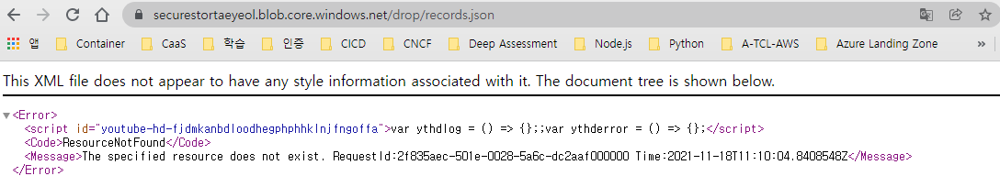

# 랩 07: 서비스 전반에서 리소스 비밀에 보다 안전하게 액세스

## 실습 1: Azure 리소스 만들기
### 작업 2: Azure Storage 계정 만들기
- 리소스 그룹 : ConfidentialStack
- 스토리지 계정 이름 : securestortaeyeol
- 위치 :  (미국) 미국 동부
- 성능 : Standard: 대부분 시나리오에 권장(범용 v2계정)
- 중복성 : LRS(로컬 중복 스토리지), Local-redundant storag(US)
- 보안 + 네트워킹 > 액세스 키
  - 키 : aAy2C1EimY++lNFid8rWteFsYVA4t+Q31OhBxvATdVhRH/QX+40Fyi/TVKoTdy7zhPJ1nGQaVcJvHsXreA7hWw==
  -  연결 문자열 : DefaultEndpointsProtocol=https;AccountName=securestortaeyeol;AccountKey=aAy2C1EimY++lNFid8rWteFsYVA4t+Q31OhBxvATdVhRH/QX+40Fyi/TVKoTdy7zhPJ1nGQaVcJvHsXreA7hWw==;EndpointSuffix=core.windows.net
### 작업 3: Azure Key Vault 만들기(키 자격 증명 모음)
- 리소스 그룹 : ConfidentialStack
- 키 자격 증명 모음 이름 : securevaulttaeyeol
- 지역 : 미국 동부
- 가격 책정 계층 : 표준

### 작업 4: Azure Functions 앱 만들기(Function App, 함수 앱)
#### 기본 탭
- 리소스 그룹 : ConfidentialStack
- 함수 앱 이름 : securefunctaeyeol
- 게시 : 코드
- 런타임 스택 :  [.NET] 
- 버전 : 3.1
- 지역 : 미국 동부, East US
#### 호스팅 탭
- 스토리지 계정 : securestortaeyeol
- 운영 체제 : Linux
- 계획 유형 : 사용(서버리스)


## 연습 2: 비밀 및 ID 구성
### 작업 1: 시스템 할당 관리 서비스 ID 구성
#### securefunctaeyeol
- 설정 > ID
  - 상태 : 켜기
    

### 작업 2: Key Vault 비밀 만들기
- securevaulttaeyeol
- 설정 > 비밀
  - 비밀 만들기
    - 업로드 옵션 : 수동
    - 이름 : storagecredentials
    - 값 : DefaultEndpointsProtocol=https;AccountName=securestortaeyeol;AccountKey=aAy2C1EimY++lNFid8rWteFsYVA4t+Q31OhBxvATdVhRH/QX+40Fyi/TVKoTdy7zhPJ1nGQaVcJvHsXreA7hWw==;EndpointSuffix=core.windows.net
    - 콘텐츠 유형 : 기본값
    - 활성화 날짜 설정 : 기본값 
    - 만료 날짜 설정 : 기본값
    - 사용 : 예
  - 비밀 식별자 : https://securevaulttaeyeol.vault.azure.net/secrets/storagecredentials/f89a3a32084342029d52062eb0c30fea

- securevaulttaeyeol4
- 비밀 식별자 : https://securevaulttaeyeol4.vault.azure.net/secrets/storagecredentials/d2d662ee91094887ba168afd43cee8d4

### 작업 3: Key Vault 액세스 정책 구성
- securevaulttaeyeol > 설정 >  액세스 정책
  - 액세스 정책 추가 > 주체 선택
    - 주체  : securefunctaeyeol 
        
    - 키 권한 : 그대로 둠
    - 비밀 권한 : 가져오기
    - 인증서 권한 : 기본값
    - 권한 있는 애플리케이션 : 그대로 둠
        

### 작업 4: Key Vault 파생 애플리케이션 설정 만들기
- 작업 4: Key Vault 파생 애플리케이션 설정 만들기
  - 애플리케이션 설정 탭  > 새 애플리케이션 설정
    - 이름 : StorageConnectionString
    - 값 : @Microsoft.KeyVault(SecretUri=DefaultEndpointsProtocol=https;AccountName=securestortaeyeol;AccountKey=aAy2C1EimY++lNFid8rWteFsYVA4t+Q31OhBxvATdVhRH/QX+40Fyi/TVKoTdy7zhPJ1nGQaVcJvHsXreA7hWw==;EndpointSuffix=core.windows.net)
      
      ![Lab07-ConfidentialStack-functionapp-setting-application-setting-2.png]  
      (./img/Lab07-ConfidentialStack-functionapp-setting-application-setting-2.png)  

## 연습 3: Azure Functions 앱 빌드
### 작업 1: 함수 프로젝트 초기화
- func init --worker-runtime dotnet --force
```
S D:\workspace\AZ204\AZ-204KO-DevelopingSolutionsforMicrosoftAzure\Allfiles\Labs\07\Starter> func init --worker-runtime dotnet --force

Writing D:\workspace\AZ204\AZ-204KO-DevelopingSolutionsforMicrosoftAzure\Allfiles\Labs\07\Starter\.vscode\extensions.json
```
- dotnet build
```
PS D:\workspace\AZ204\AZ-204KO-DevelopingSolutionsforMicrosoftAzure\Allfiles\Labs\07\Starter> dotnet build
.NET용 Microsoft (R) Build Engine 버전 17.0.0+c9eb9dd64
Copyright (C) Microsoft Corporation. All rights reserved.

  복원할 프로젝트를 확인하는 중...
  D:\workspace\AZ204\AZ-204KO-DevelopingSolutionsforMicrosoftAzure\Allfiles\Labs\07\Starter\Starter.csproj을(를) 10.7 sec 동안 복원했습니다.
  Starter -> D:\workspace\AZ204\AZ-204KO-DevelopingSolutionsforMicrosoftAzure\Allfiles\Labs\07\Starter\bin\Debug\netcoreapp3.1\Starter.dll

빌드했습니다.
    경고 0개
    오류 0개

경과 시간: 00:00:19.15
PS D:\workspace\AZ204\AZ-204KO-DevelopingSolutionsforMicrosoftAzure\Allfiles\Labs\07\Starter>
```

### 작업 2: HTTP 트리거 함수 만들기
#### 1. HTTP 트리거 템플릿을 통해 FileParser라는 이름의 새 함수를 만듦
- func new --template "HTTP trigger" --name "FileParser"

```
PS D:\workspace\AZ204\AZ-204KO-DevelopingSolutionsforMicrosoftAzure\Allfiles\Labs\07\Starter> func new --template "HTTP trigger" --name "FileParser"
Use the up/down arrow keys to select a template:Function name: FileParser
일치하는 템플릿이 없음:'HTTPtrigger'.

설치된 템플릿을 나열하려면 다음을 실행하세요.
   dotnet new --list
NuGet.org에서 템플릿을 검색하려면 다음을 실행하세요.
   dotnet new HTTPtrigger --search


Error creating function
```
> [Azure Functions 핵심 도구 작업](https://docs.microsoft.com/ko-kr/azure/azure-functions/functions-run-local?tabs=v4%2Cwindows%2Ccsharp%2Cportal%2Cbash%2Ckeda)
```
PS D:\workspace\AZ204\AZ-204KO-DevelopingSolutionsforMicrosoftAzure\Allfiles\Labs\07\Starter> npm install -g azure-functions-core-tools@3 --unsafe-perm true

changed 51 packages, and audited 52 packages in 3m

found 0 vulnerabilities
```

```
PS D:\workspace\AZ204\AZ-204KO-DevelopingSolutionsforMicrosoftAzure\Allfiles\Labs\07\Starter>  dotnet new HTTPtrigger --search
템플릿 검색 중...
템플릿 소스에서 일치:NuGet.org
이 템플릿은 입력 내용과 일치합니다. 'HTTPtrigger'

템플릿 이름                  약식 이름        만든 사람      언어       패키지                                               다운로드
----------------------  -----------  ---------  -------  ----------------------------------------------  ------
HttpTrigger             http         Microsoft  [C#],F#  Microsoft.Azure.WebJobs.ItemTemplates           4,956k
HttpTrigger             http         Microsoft  [C#]     Microsoft.Azure.Functions.Worker.ItemTemplates    378k
HttpTriggerWithOpenAPI  httpOpenAPI  Microsoft  [C#]     Microsoft.Azure.WebJobs.ItemTemplates           4,956k


템플릿을 사용하려면 다음 명령을 실행하여 패키지를 설치하세요.
   dotnet new --install <PACKAGE_ID>
예:
   dotnet new --install Microsoft.Azure.WebJobs.ItemTemplates
PS D:\workspace\AZ204\AZ-204KO-DevelopingSolutionsforMicrosoftAzure\Allfiles\Labs\07\Starter>
```
```
PS D:\workspace\AZ204\AZ-204KO-DevelopingSolutionsforMicrosoftAzure\Allfiles\Labs\07\Starter> dotnet new --install Microsoft.Azure.WebJobs.ItemTemplates
다음 템플릿 패키지가 설치됩니다.
   Microsoft.Azure.WebJobs.ItemTemplates

성공:Microsoft.Azure.WebJobs.ItemTemplates::4.0.1964이(가) 다음 템플릿을 설치했습니다.
템플릿 이름                         약식 이름            언어       태그
-----------------------------  ---------------  -------  ----------------------------------------------
BlobTrigger                    blob             [C#],F#  Azure Function/Trigger/Blob
CosmosDBTrigger                cosmos,CosmosDB  [C#],F#  Azure Function/Trigger/Cosmos DB
DurableFunctionsOrchestration  durable          [C#]     Azure Function/Durable Functions Orchestration
EventGridTrigger               eventgrid        [C#]     Azure Function/Trigger/EventGrid
EventHubTrigger                eventhub         [C#],F#  Azure Function/Trigger/EventHub
HttpTrigger                    http             [C#],F#  Azure Function/Trigger/Http
HttpTriggerWithOpenAPI         httpOpenAPI      [C#]     Azure Function/Trigger/Http
IotHubTrigger                  iothub           [C#]     Azure Function/Trigger/IotHub
KafkaOutput                    kafkao           [C#]     Azure Function/Ouput/Kafka
KafkaTrigger                   kafka            [C#]     Azure Function/Trigger/Kafka
QueueTrigger                   queue            [C#]     Azure Function/Trigger/Storage Queue
RabbitMQTrigger                rqueue           [C#]     Azure Function/Trigger/RabbitMQ Queue
SendGrid                       sendgrid         [C#]     Azure Function/Ouput/SendGrid
ServiceBusQueueTrigger         squeue           [C#]     Azure Function/Trigger/Service Bus/Queue
ServiceBusTopicTrigger         stopic           [C#]     Azure Function/Trigger/Service Bus/Topic
SignalRTrigger                 signalr          [C#]     Azure Function/Trigger/Http/SignalR
TimerTrigger                   timer            [C#],F#  Azure Function/Trigger/Timer

PS D:\workspace\AZ204\AZ-204KO-DevelopingSolutionsforMicrosoftAzure\Allfiles\Labs\07\Starter>
```
```
PS D:\workspace\AZ204\AZ-204KO-DevelopingSolutionsforMicrosoftAzure\Allfiles\Labs\07\Starter> npm install -g azure-functions-core-tools@4 --unsafe-perm true

changed 51 packages, and audited 52 packages in 2m

found 0 vulnerabilities
```
```
PS D:\workspace\AZ204\AZ-204KO-DevelopingSolutionsforMicrosoftAzure\Allfiles\Labs\07\Starter> func new --template "HTTP trigger" --name "FileParser"
Use the up/down arrow keys to select a template:Function name: FileParser

The function "FileParser" was created successfully from the "HTTP trigger" template.
PS D:\workspace\AZ204\AZ-204KO-DevelopingSolutionsforMicrosoftAzure\Allfiles\Labs\07\Starter> 
```

### 작업 3: 애플리케이션 설정 구성 및 읽기
- [local.settings.json](..\AZ-204KO-DevelopingSolutionsforMicrosoftAzure\Allfiles\Labs\07\Starter\local.settings.json)
  - "StorageConnectionString": "[TEST VALUE]" 추가
- [FileParser.cs](..\AZ-204KO-DevelopingSolutionsforMicrosoftAzure\Allfiles\Labs\07\Starter\FileParser.cs)

### 작업 4: 로컬 함수 유효성 검사
#### 함수 앱 프로젝트를 실행
- func start --build 
```
PS D:\workspace\AZ204\AZ-204KO-DevelopingSolutionsforMicrosoftAzure\Allfiles\Labs\07\Starter> func start --build
.NET용 Microsoft (R) Build Engine 버전 17.0.0+c9eb9dd64
Copyright (C) Microsoft Corporation. All rights reserved.

  복원할 프로젝트를 확인하는 중...
  복원할 모든 프로젝트가 최신 상태입니다.
D:\workspace\AZ204\AZ-204KO-DevelopingSolutionsforMicrosoftAzure\Allfiles\Labs\07\Starter\FileParser.cs(14,45): warning CS1998: 이 비동기 메서드에는 'await' 연산자가 없으며 메서드가 
동시에 실행됩니다. 'await' 연산자를 사용하여 비블로킹 API 호출을 대기하거나, 'await Task.Run(...)'을 사용하여 백그라운드 스레드에서 CPU 바인딩된 작업을 수행하세요. [D:\workspace\AZ204\AZ-204KO-DevelopingSolutionsforMicrosoftAzure\Allfiles\Labs\07\Starter\Starter.csproj]
  Starter -> D:\workspace\AZ204\AZ-204KO-DevelopingSolutionsforMicrosoftAzure\Allfiles\Labs\07\Starter\bin\output\Starter.dll

빌드했습니다.

D:\workspace\AZ204\AZ-204KO-DevelopingSolutionsforMicrosoftAzure\Allfiles\Labs\07\Starter\FileParser.cs(14,45): warning CS1998: 이 비동기 메서드에는 'await' 연산자가 없으며 메서드가 
동시에 실행됩니다. 'await' 연산자를 사용하여 비블로킹 API 호출을 대기하거나, 'await Task.Run(...)'을 사용하여 백그라운드 스레드에서 CPU 바인딩된 작업을 수행하세요. [D:\workspace\AZ204\AZ-204KO-DevelopingSolutionsforMicrosoftAzure\Allfiles\Labs\07\Starter\Starter.csproj]
    경고 1개
    오류 0개

경과 시간: 00:00:04.32


Azure Functions Core Tools
Core Tools Version:       4.0.3971 Commit hash: d0775d487c93ebd49e9c1166d5c3c01f3c76eaaf  (64-bit)
Function Runtime Version: 4.0.1.16815

[2021-11-18T10:29:32.068Z] Found D:\workspace\AZ204\AZ-204KO-DevelopingSolutionsforMicrosoftAzure\Allfiles\Labs\07\Starter\Starter.csproj. Using for user secrets file configuration.

Functions:

        FileParser: [GET] http://localhost:7071/api/FileParser

For detailed output, run func with --verbose flag.
[2021-11-18T10:30:21.909Z] Executing 'FileParser' (Reason='This function was programmatically called via the host APIs.', Id=8bea7635-b161-43cb-b60c-13030f61e7d0)
[2021-11-18T10:30:21.942Z] Executed 'FileParser' (Succeeded, Id=8bea7635-b161-43cb-b60c-13030f61e7d0, Duration=52ms)
[2021-11-18T10:32:09.414Z] Executing 'FileParser' (Reason='This function was programmatically called via the host APIs.', Id=4616bc2c-109f-4cb7-8481-33b25a9502e1)
[2021-11-18T10:32:09.416Z] Executed 'FileParser' (Succeeded, Id=4616bc2c-109f-4cb7-8481-33b25a9502e1, Duration=1ms)
[2021-11-18T10:34:00.305Z] Executing 'FileParser' (Reason='This function was programmatically called via the host APIs.', Id=fe1cca48-461c-4ce7-9269-4acbb579a148)
[2021-11-18T10:34:00.308Z] Executed 'FileParser' (Succeeded, Id=fe1cca48-461c-4ce7-9269-4acbb579a148, Duration=2ms)
[2021-11-18T10:34:14.649Z] Executing 'FileParser' (Reason='This function was programmatically called via the host APIs.', Id=a69a2486-c0ca-45db-a492-8fa1defc5fdf)
[2021-11-18T10:34:14.651Z] Executed 'FileParser' (Succeeded, Id=a69a2486-c0ca-45db-a492-8fa1defc5fdf, Duration=2ms)
PS D:\workspace\AZ204\AZ-204KO-DevelopingSolutionsforMicrosoftAzure\Allfiles\Labs\07\Starter> 
```
- 잘못되 url 로 들어가 요청할 수 있음(한번 더 해 정상 처리)
```
PS C:\Users\Administrator> httprepl http://localhost:7071
(Disconnected)> connect http://localhost:7071
Using a base address of http://localhost:7071/
Unable to find an OpenAPI description
For detailed tool info, see https://aka.ms/http-repl-doc

http://localhost:7071/> cd api

http://localhost:7071/api> cd fileparserd

http://localhost:7071/api/fileparserd> get
HTTP/1.1 404 Not Found
Content-Length: 0
Date: Thu, 18 Nov 2021 10:29:57 GMT
Server: Kestrel


http://localhost:7071/api/fileparserd> cd ..

http://localhost:7071/api> cd FileParser

http://localhost:7071/api/FileParser> get
HTTP/1.1 200 OK
Content-Type: text/plain; charset=utf-8
Date: Thu, 18 Nov 2021 10:30:21 GMT
Server: Kestrel
Transfer-Encoding: chunked

[TEST VALUE]


http://localhost:7071/api/FileParser> exit
PS C:\Users\Administrator>
```
```
PS C:\Users\Administrator> httprepl http://localhost:7071
(Disconnected)> connect http://localhost:7071
Using a base address of http://localhost:7071/
Unable to find an OpenAPI description
For detailed tool info, see https://aka.ms/http-repl-doc

http://localhost:7071/> cd api

http://localhost:7071/api> cd FileParser

http://localhost:7071/api/FileParser> get
HTTP/1.1 200 OK
Content-Type: text/plain; charset=utf-8
Date: Thu, 18 Nov 2021 10:34:14 GMT
Server: Kestrel
Transfer-Encoding: chunked

[TEST VALUE]


http://localhost:7071/api/FileParser> exti
No matching command found
Execute 'help' to see available commands

http://localhost:7071/api/FileParser>
```
  


### 작업 5: Azure Functions Core Tools를 사용하여 배포
- func azure functionapp publish securefunctaeyeol
```
PS D:\workspace\AZ204\AZ-204KO-DevelopingSolutionsforMicrosoftAzure\Allfiles\Labs\07\Starter> func azure functionapp publish securefunctaeyeol
.NET용 Microsoft (R) Build Engine 버전 17.0.0+c9eb9dd64
Copyright (C) Microsoft Corporation. All rights reserved.

  복원할 프로젝트를 확인하는 중...
  복원할 모든 프로젝트가 최신 상태입니다.
D:\workspace\AZ204\AZ-204KO-DevelopingSolutionsforMicrosoftAzure\Allfiles\Labs\07\Starter\FileParser.cs(14,45): warning CS1998: 이 비동기 메서드에는 'await' 연산자가 없으며 메서드가 
동시에 실행됩니다. 'await' 연산자를 사용하여 비블로킹 API 호출을 대기하거나, 'await Task.Run(...)'을 사용하여 백그라운드 스레드에서 CPU 바인딩된 작업을 수행하세요. [D:\workspace\AZ204\AZ-204KO-DevelopingSolutionsforMicrosoftAzure\Allfiles\Labs\07\Starter\Starter.csproj]
  Starter -> D:\workspace\AZ204\AZ-204KO-DevelopingSolutionsforMicrosoftAzure\Allfiles\Labs\07\Starter\bin\publish\Starter.dll

빌드했습니다.

D:\workspace\AZ204\AZ-204KO-DevelopingSolutionsforMicrosoftAzure\Allfiles\Labs\07\Starter\FileParser.cs(14,45): warning CS1998: 이 비동기 메서드에는 'await' 연산자가 없으며 메서드가 
동시에 실행됩니다. 'await' 연산자를 사용하여 비블로킹 API 호출을 대기하거나, 'await Task.Run(...)'을 사용하여 백그라운드 스레드에서 CPU 바인딩된 작업을 수행하세요. [D:\workspace\AZ204\AZ-204KO-DevelopingSolutionsforMicrosoftAzure\Allfiles\Labs\07\Starter\Starter.csproj]
    경고 1개
    오류 0개

경과 시간: 00:00:06.81


Getting site publishing info...
Uploading package...
Uploading 2.3 MB [################################################################################]
Upload completed successfully.
Deployment completed successfully.
Syncing triggers...
Functions in securefunctaeyeol:
    FileParser - [httpTrigger]
        Invoke url: https://securefunctaeyeol.azurewebsites.net/api/fileparser?code=7HUCJ4wZeZ1dE6YzuHlPYgWfrsvurSiPRtP/JmVDEOTDHBVszShBaQ==

PS D:\workspace\AZ204\AZ-204KO-DevelopingSolutionsforMicrosoftAzure\Allfiles\Labs\07\Starter> 
```

### 작업 6: 키 자격 증명 모음 파생 애플리케이션 설정 테스트
  

## 연습 4: Azure Blob Storage 데이터 액세스
### 작업 1: 샘플 Storage Blob 업로드
#### securestortaeyeol | 컨테이너 > 새 컨테이너
- 이름 : drop
- 공용 액세스 수준 : Blob(Blob에 대해서만 익명 읽기 액세스)
  
- drop 컨테이너 > upload   
  
- drop 컨테이버 url : https://securestortaeyeol.blob.core.windows.net/drop/records.json
- drop 컨테이너 > 액세스 수준 변경
  - 공용 액세스 수준 : 프라이빗(익명 액세스 없음)
  
  

### 작업 2: .NET용 Azure SDK 끌어오기 및 구성
- Azure.Storage.Blobs NuGet 패키지는 Azure Blob Storage용 코드를 작성하는 데 필요한 .NET용 Azure SDK의 하위 집합을 참조
- dotnet add package Azure.Storage.Blobs --version 12.6.0
```
PS D:\workspace\AZ204\AZ-204KO-DevelopingSolutionsforMicrosoftAzure\Allfiles\Labs\07\Starter> dotnet add package Azure.Storage.Blobs --version 12.6.0
  복원할 프로젝트를 확인하는 중...
  Writing C:\Users\Administrator\AppData\Local\Temp\tmpEE44.tmp
info : 'D:\workspace\AZ204\AZ-204KO-DevelopingSolutionsforMicrosoftAzure\Allfiles\Labs\07\Starter\Starter.csproj' 프로젝트에 'Azure.Storage.Blobs' 패키지에 대한 PackageReference를 추
가하는 중입니다.
info : D:\workspace\AZ204\AZ-204KO-DevelopingSolutionsforMicrosoftAzure\Allfiles\Labs\07\Starter\Starter.csproj의 패키지를 복원하는 중...
info :   GET https://api.nuget.org/v3-flatcontainer/azure.storage.blobs/index.json
info :   OK https://api.nuget.org/v3-flatcontainer/azure.storage.blobs/index.json 736밀리초
info :   GET https://api.nuget.org/v3-flatcontainer/azure.storage.blobs/12.6.0/azure.storage.blobs.12.6.0.nupkg
info :   OK https://api.nuget.org/v3-flatcontainer/azure.storage.blobs/12.6.0/azure.storage.blobs.12.6.0.nupkg 45밀리초
info :   GET https://api.nuget.org/v3-flatcontainer/azure.storage.common/index.json
info :   GET https://api.nuget.org/v3-flatcontainer/azure.core/index.json
info :   GET https://api.nuget.org/v3-flatcontainer/system.text.json/index.json
info :   OK https://api.nuget.org/v3-flatcontainer/system.text.json/index.json 853밀리초
info :   GET https://api.nuget.org/v3-flatcontainer/system.text.json/4.6.0/system.text.json.4.6.0.nupkg
info :   OK https://api.nuget.org/v3-flatcontainer/system.text.json/4.6.0/system.text.json.4.6.0.nupkg 34밀리초
info :   OK https://api.nuget.org/v3-flatcontainer/azure.storage.common/index.json 4867밀리초
info :   GET https://api.nuget.org/v3-flatcontainer/azure.storage.common/12.5.2/azure.storage.common.12.5.2.nupkg
info :   OK https://api.nuget.org/v3-flatcontainer/azure.storage.common/12.5.2/azure.storage.common.12.5.2.nupkg 44밀리초
info :   OK https://api.nuget.org/v3-flatcontainer/azure.core/index.json 4940밀리초
info :   GET https://api.nuget.org/v3-flatcontainer/azure.core/1.4.1/azure.core.1.4.1.nupkg
info :   OK https://api.nuget.org/v3-flatcontainer/azure.core/1.4.1/azure.core.1.4.1.nupkg 731밀리초
info : 콘텐츠 해시 6LbGLiZwlU6SfOaINCfrQ+f91bRWZ8XvB90Qfm69x1t3z+5D4jmXnQiuPYPZcgtxFjPKA3IwyHGuDZRkSo1Urg==을(를) 사용하여 https://api.nuget.org/v3/index.json에서 Azure.Core 1.4.1을(를) 설치했습니다.
info : 콘텐츠 해시 Sd6C0TgGkzEHcNv95jO52vN1TroTrBRCJJOCog6NEfUoAnmxUus4j9QraDfITvxIIMdyKg7WXB6vX58Bq2/WaQ==을(를) 사용하여 https://api.nuget.org/v3/index.json에서 Azure.Storage.Common 12.5.2을(를) 설치했습니다.
info : 콘텐츠 해시 dyrUge8qg6MeI9kln5GPWm232iF+u/BpN2pkzaHUYltqkvqTv9EDIXuG7dYYVCX5ZrOQoiN+Cl42qEQSC/cLXA==을(를) 사용하여 https://api.nuget.org/v3/index.json에서 Azure.Storage.Blobs 12.6.0을(를) 설치했습니다.
info : 콘텐츠 해시 4F8Xe+JIkVoDJ8hDAZ7HqLkjctN/6WItJIzQaifBwClC7wmoLSda/Sv2i6i1kycqDb3hWF4JCVbpAweyOKHEUA==을(를) 사용하여 https://api.nuget.org/v3/index.json에서 System.Text.Json 4.6.0을(를) 설치했습니다.
info : 'Azure.Storage.Blobs' 패키지는 'D:\workspace\AZ204\AZ-204KO-DevelopingSolutionsforMicrosoftAzure\Allfiles\Labs\07\Starter\Starter.csproj' 프로젝트에 지정된 모든 프레임워크와  
호환됩니다.
info : 'Azure.Storage.Blobs' 패키지 '12.6.0' 버전에 대한 PackageReference가 'D:\workspace\AZ204\AZ-204KO-DevelopingSolutionsforMicrosoftAzure\Allfiles\Labs\07\Starter\Starter.csproj' 파일에 추가되었습니다.
info : 복원을 커밋하는 중...
info : 자산 파일을 디스크에 쓰는 중입니다. 경로: D:\workspace\AZ204\AZ-204KO-DevelopingSolutionsforMicrosoftAzure\Allfiles\Labs\07\Starter\obj\project.assets.json
log  : D:\workspace\AZ204\AZ-204KO-DevelopingSolutionsforMicrosoftAzure\Allfiles\Labs\07\Starter\Starter.csproj을(를) 9.13 sec 동안 복원했습니다.
PS D:\workspace\AZ204\AZ-204KO-DevelopingSolutionsforMicrosoftAzure\Allfiles\Labs\07\Starter>
```

### 작업 3: .NET용 Azure SDK를 사용하여 Azure Blob Storage 코드 작성
- [FileParser.cs](..\AZ-204KO-DevelopingSolutionsforMicrosoftAzure\Allfiles\Labs\07\Starter\FileParser.cs)
```C#
using Azure.Storage.Blobs;
using Microsoft.AspNetCore.Mvc;
using Microsoft.Azure.WebJobs;
using Microsoft.AspNetCore.Http;
using System;
using System.Threading.Tasks;

public static class FileParser
{
    [FunctionName("FileParser")]
    public static async Task<IActionResult> Run(
        [HttpTrigger("GET")] HttpRequest request)
    {
        string connectionString = Environment.GetEnvironmentVariable("StorageConnectionString");
        BlobClient blob = new BlobClient(connectionString, "drop", "records.json");
        var response = await blob.DownloadAsync();
        return new FileStreamResult(response?.Value?.Content, response?.Value?.ContentType);
    }
}
```


### 작업 4: Azure Functions 앱 배포 및 유효성 검사
#### 배포 
- func azure functionapp publish securefunctaeyeol
```
PS D:\workspace\AZ204\AZ-204KO-DevelopingSolutionsforMicrosoftAzure\Allfiles\Labs\07\Starter> func azure functionapp publish securefunctaeyeol
.NET용 Microsoft (R) Build Engine 버전 17.0.0+c9eb9dd64
Copyright (C) Microsoft Corporation. All rights reserved.

  복원할 프로젝트를 확인하는 중...
  복원할 모든 프로젝트가 최신 상태입니다.
  Starter -> D:\workspace\AZ204\AZ-204KO-DevelopingSolutionsforMicrosoftAzure\Allfiles\Labs\07\Starter\bin\publish\Starter.dll

빌드했습니다.
    경고 0개
    오류 0개

경과 시간: 00:00:05.38


Getting site publishing info...
Uploading package...
Uploading 3.05 MB [###############################################################################]
Upload completed successfully.
Deployment completed successfully.
Syncing triggers...
Functions in securefunctaeyeol:
    FileParser - [httpTrigger]
        Invoke url: https://securefunctaeyeol.azurewebsites.net/api/fileparser?code=7HUCJ4wZeZ1dE6YzuHlPYgWfrsvurSiPRtP/JmVDEOTDHBVszShBaQ==

PS D:\workspace\AZ204\AZ-204KO-DevelopingSolutionsforMicrosoftAzure\Allfiles\Labs\07\Starter> 
```

- 오류 로그
```
연결되었습니다.
2021-11-18T11:20:01Z   [Information]   Executing 'FileParser' (Reason='This function was programmatically called via the host APIs.', Id=f7c93cc5-f04d-4ddd-90f8-073f70d0ff9b)
2021-11-18T11:20:01Z   [Error]   Executed 'FileParser' (Failed, Id=f7c93cc5-f04d-4ddd-90f8-073f70d0ff9b, Duration=2ms)
2021-11-18T11:22:26Z   [Information]   Executing 'FileParser' (Reason='This function was programmatically called via the host APIs.', Id=a879ceb2-a889-4678-b7d3-2a7a1ef9abc3)
2021-11-18T11:22:26Z   [Error]   Executed 'FileParser' (Failed, Id=a879ceb2-a889-4678-b7d3-2a7a1ef9abc3, Duration=3ms)
2021-11-18T11:22:33Z   [Information]   Executing 'FileParser' (Reason='This function was programmatically called via the host APIs.', Id=16363b10-b902-4520-9401-e1b1f8001e82)
2021-11-18T11:22:33Z   [Error]   Executed 'FileParser' (Failed, Id=16363b10-b902-4520-9401-e1b1f8001e82, Duration=2ms)
2021-11-18T11:22:43Z   [Information]   Executing 'FileParser' (Reason='This function was programmatically called via the host APIs.', Id=180c94ba-07c2-443b-87fe-0d3230128ba5)
2021-11-18T11:22:43Z   [Error]   Executed 'FileParser' (Failed, Id=180c94ba-07c2-443b-87fe-0d3230128ba5, Duration=2ms)
2021-11-18T11:22:55Z   [Information]   Executing 'FileParser' (Reason='This function was programmatically called via the host APIs.', Id=a19a60e3-5a37-4868-ae95-3a50637680b1)
2021-11-18T11:22:55Z   [Error]   Executed 'FileParser' (Failed, Id=a19a60e3-5a37-4868-ae95-3a50637680b1, Duration=3ms)
2021-11-18T11:23:12Z   [Information]   Executing 'FileParser' (Reason='This function was programmatically called via the host APIs.', Id=6fd32ac4-51e8-4201-a717-b7af7122dd25)
2021-11-18T11:23:12Z   [Error]   Executed 'FileParser' (Failed, Id=6fd32ac4-51e8-4201-a717-b7af7122dd25, Duration=1ms)
2021-11-18T11:27:50Z   [Information]   Executing 'FileParser' (Reason='This function was programmatically called via the host APIs.', Id=bada208b-5005-4555-852e-fea04db192bc)
2021-11-18T11:27:50Z   [Error]   Executed 'FileParser' (Failed, Id=bada208b-5005-4555-852e-fea04db192bc, Duration=36ms)
2021-11-18T11:28:00Z   [Information]   Executing 'FileParser' (Reason='This function was programmatically called via the host APIs.', Id=481cea95-6f7f-4d24-be3c-4bc89994f821)
2021-11-18T11:28:00Z   [Error]   Executed 'FileParser' (Failed, Id=481cea95-6f7f-4d24-be3c-4bc89994f821, Duration=2ms)
```


## 연습 5: 구독 정리
```
az group delete --name ConfidentialStack --no-wait --yes
```

## 연습 4: 함수(securefunctaeyeol4) 
### 함수 만들기
- func init --worker-runtime dotnet --force
```
PS C:\workspace\AZ204\2021-11-18\securefunctaeyeol4> func init --worker-runtime dotnet --force

C:\workspace\AZ204\2021-11-18\securefunctaeyeol4\.vscode\extensions.json already exists. Skipped!
```

### 함수 추가
- func new --template "HTTP trigger" --name "FileParser"
```
PS C:\workspace\AZ204\2021-11-18\securefunctaeyeol4> func new --template "HTTP trigger" --name "FileParser"
Use the up/down arrow keys to select a template:Function name: FileParser

The function "FileParser" was created successfully from the "HTTP trigger" template.
PS C:\workspace\AZ204\2021-11-18\securefunctaeyeol4> dotnet build
.NET용 Microsoft (R) Build Engine 버전 17.0.0+c9eb9dd64
Copyright (C) Microsoft Corporation. All rights reserved.

  복원할 프로젝트를 확인하는 중...
  복원할 모든 프로젝트가 최신 상태입니다.
  securefunctaeyeol4 -> C:\workspace\AZ204\2021-11-18\securefunctaeyeol4\bin\Debug\net6.0\securefunctaeyeol4.dll

빌드했습니다.
    경고 0개
    오류 0개

경과 시간: 00:00:01.89
```

### 빌드
-  dotnet build
```
PS C:\workspace\AZ204\2021-11-18\securefunctaeyeol4> dotnet build
.NET용 Microsoft (R) Build Engine 버전 17.0.0+c9eb9dd64
Copyright (C) Microsoft Corporation. All rights reserved.

  복원할 프로젝트를 확인하는 중...
  복원할 모든 프로젝트가 최신 상태입니다.
C:\workspace\AZ204\2021-11-18\securefunctaeyeol4\FileParser.cs(15,45): warning CS1998: 이 비동기 메서드에는 'await' 연산자가 없으며 메서드가 동시에 실행됩니다. 'await' 연산자를 사용하여 비블로킹 API 호출을 대기하거나, 'await Task.Run(...)'을 사용하여 백그라운드 스레드에서 CPU 바인딩된 작업을 수행하세요. [C:\workspace\AZ204\2021-11-18\securefunctaeyeol4\securefunctaeyeol4.csproj]
  securefunctaeyeol4 -> C:\workspace\AZ204\2021-11-18\securefunctaeyeol4\bin\Debug\net6.0\securefunctaeyeol4.dll

빌드했습니다.

C:\workspace\AZ204\2021-11-18\securefunctaeyeol4\FileParser.cs(15,45): warning CS1998: 이 비동기 메서드에는 'await' 연산자가 없으며 메서드가 동시에 실행됩니다. 'await' 연산자를 사용하여 비블로킹 API 호출을 대기하거나, 'await Task.Run(...)'을 사용하여 백그라운드 스레드에서 CPU 바인딩된 작업을 수행하세요. [C:\workspace\AZ204\2021-11-18\securefunctaeyeol4\securefunctaeyeol4.csproj]
    경고 1개
    오류 0개

경과 시간: 00:00:01.66
PS C:\workspace\AZ204\2021-11-18\securefunctaeyeol4> 
```

### 테스트
-  func start --build
```
PS C:\workspace\AZ204\2021-11-18\securefunctaeyeol4> func start --build
.NET용 Microsoft (R) Build Engine 버전 17.0.0+c9eb9dd64
Copyright (C) Microsoft Corporation. All rights reserved.

  복원할 프로젝트를 확인하는 중...
  복원할 모든 프로젝트가 최신 상태입니다.
  securefunctaeyeol4 -> C:\workspace\AZ204\2021-11-18\securefunctaeyeol4\bin\output\securefunctaeyeol4.dll

빌드했습니다.
    경고 0개
    오류 0개

경과 시간: 00:00:02.07


Azure Functions Core Tools
Core Tools Version:       4.0.3971 Commit hash: d0775d487c93ebd49e9c1166d5c3c01f3c76eaaf  (64-bit)
Function Runtime Version: 4.0.1.16815

[2021-11-18T15:04:30.008Z] Found C:\workspace\AZ204\2021-11-18\securefunctaeyeol4\securefunctaeyeol4.csproj. Using for user secrets file configuration.

Functions:

        FileParser: [GET] http://localhost:7071/api/FileParser

For detailed output, run func with --verbose flag.
[2021-11-18T15:04:54.235Z] Executing 'FileParser' (Reason='This function was programmatically called via the host APIs.', Id=18f303b0-28f8-4bbb-8285-a9a24a14d141)
[2021-11-18T15:04:54.258Z] Executed 'FileParser' (Succeeded, Id=18f303b0-28f8-4bbb-8285-a9a24a14d141, Duration=35ms)
PS C:\workspace\AZ204\2021-11-18\securefunctaeyeol4> func start --build
.NET용 Microsoft (R) Build Engine 버전 17.0.0+c9eb9dd64
Copyright (C) Microsoft Corporation. All rights reserved.

  복원할 프로젝트를 확인하는 중...
  복원할 모든 프로젝트가 최신 상태입니다.
  securefunctaeyeol4 -> C:\workspace\AZ204\2021-11-18\securefunctaeyeol4\bin\output\securefunctaeyeol4.dll

빌드했습니다.
    경고 0개
    오류 0개

경과 시간: 00:00:02.05


Azure Functions Core Tools
Core Tools Version:       4.0.3971 Commit hash: d0775d487c93ebd49e9c1166d5c3c01f3c76eaaf  (64-bit)
Function Runtime Version: 4.0.1.16815

[2021-11-18T15:05:41.353Z] Found C:\workspace\AZ204\2021-11-18\securefunctaeyeol4\securefunctaeyeol4.csproj. Using for user secrets file configuration.

Functions:

        FileParser: [GET] http://localhost:7071/api/FileParser

For detailed output, run func with --verbose flag.
[2021-11-18T15:05:53.957Z] Executing 'FileParser' (Reason='This function was programmatically called via the host APIs.', Id=d00e298d-3ad8-448d-9d28-a75ebaa494ad)
[2021-11-18T15:05:53.982Z] Executed 'FileParser' (Succeeded, Id=d00e298d-3ad8-448d-9d28-a75ebaa494ad, Duration=36ms)
PS C:\workspace\AZ204\2021-11-18\securefunctaeyeol4> ^C
```
- HttpRepl
```
PS C:\Users\taeey> httprepl http://localhost:7071
(Disconnected)> connect http://localhost:7071
Using a base address of http://localhost:7071/
Unable to find an OpenAPI description
For detailed tool info, see https://aka.ms/http-repl-doc

http://localhost:7071/> cd api

http://localhost:7071/api> cd FileParser

http://localhost:7071/api/FileParser> get
HTTP/1.1 200 OK
Content-Type: text/plain; charset=utf-8
Date: Thu, 18 Nov 2021 15:05:53 GMT
Server: Kestrel
Transfer-Encoding: chunked

[TEST VALUE]


http://localhost:7071/api/FileParser> exit
PS C:\Users\taeey>
```
### 배포
- func azure functionapp publish securefunctaeyeol4
```
PS C:\workspace\AZ204\2021-11-18\securefunctaeyeol4> func azure functionapp publish securefunctaeyeol4
.NET용 Microsoft (R) Build Engine 버전 17.0.0+c9eb9dd64
Copyright (C) Microsoft Corporation. All rights reserved.

  복원할 프로젝트를 확인하는 중...
  복원할 모든 프로젝트가 최신 상태입니다.
C:\workspace\AZ204\2021-11-18\securefunctaeyeol4\FileParser.cs(15,45): warning CS1998: 이 비동기 메서드에는 'await' 연산자가 없으며 메서드가 동시에 실행됩니다. 'await' 연산자를 사용하여 비블로킹 API 호출을 대기하거나, 'await Task.Run(...)'을 사용하여 백그라운드 스레드에서 CPU 바인딩된 작업을 수행하세요. [C:\workspace\AZ204\2021-11-18\securefunctaeyeol4\securefunctaeyeol4.csproj]
  securefunctaeyeol4 -> C:\workspace\AZ204\2021-11-18\securefunctaeyeol4\bin\publish\securefunctaeyeol4.dll

빌드했습니다.

C:\workspace\AZ204\2021-11-18\securefunctaeyeol4\FileParser.cs(15,45): warning CS1998: 이 비동기 메서드에는 'await' 연산자가 없으며 메서드가 동시에 실행됩니다. 'await' 연산자를 사용하여 비블로킹 API 호출을 대기하거나, 'await Task.Run(...)'을 사용하여 백그라운드 스레드에서 CPU 바인딩된 작업을 수행하세요. [C:\workspace\AZ204\2021-11-18\securefunctaeyeol4\securefunctaeyeol4.csproj]
    경고 1개
    오류 0개

경과 시간: 00:00:01.87


Getting site publishing info...
Creating archive for current directory...
Uploading 2.34 MB [###############################################################################]
Upload completed successfully.
Deployment completed successfully.
Syncing triggers...
Functions in securefunctaeyeol4:
    FileParser - [httpTrigger]
        Invoke url: https://securefunctaeyeol4.azurewebsites.net/api/fileparser?code=y/RyyESmMakiBthfVPpw1l3MDS2PKn21a80gT25sNKEaFChTbNjcrw==

PS C:\workspace\AZ204\2021-11-18\securefunctaeyeol4> 
```

### Azure.Storage.Blobs 패키지 12.6.0 설치
- dotnet add package Azure.Storage.Blobs --version 12.6.0
```
PS C:\workspace\AZ204\2021-11-18\securefunctaeyeol4> dotnet add package Azure.Storage.Blobs --version 12.6.0
  복원할 프로젝트를 확인하는 중...
  Writing C:\Users\taeey\AppData\Local\Temp\tmp6BD0.tmp
info : 'C:\workspace\AZ204\2021-11-18\securefunctaeyeol4\securefunctaeyeol4.csproj' 프로젝트에 'Azure.Storage.Blobs' 패키지에 대한 PackageReference를 추가하는 중입니다.
info : C:\workspace\AZ204\2021-11-18\securefunctaeyeol4\securefunctaeyeol4.csproj의 패키지를 복원하는 중...
info :   GET https://api.nuget.org/v3-flatcontainer/azure.storage.blobs/index.json
info :   OK https://api.nuget.org/v3-flatcontainer/azure.storage.blobs/index.json 725밀리초
info :   GET https://api.nuget.org/v3-flatcontainer/azure.storage.blobs/12.6.0/azure.storage.blobs.12.6.0.nupkg
info :   OK https://api.nuget.org/v3-flatcontainer/azure.storage.blobs/12.6.0/azure.storage.blobs.12.6.0.nupkg 41밀리초
info :   GET https://api.nuget.org/v3-flatcontainer/azure.storage.common/index.json
info :   GET https://api.nuget.org/v3-flatcontainer/azure.core/index.json
info :   GET https://api.nuget.org/v3-flatcontainer/system.text.json/index.json
info :   OK https://api.nuget.org/v3-flatcontainer/system.text.json/index.json 881밀리초
info :   GET https://api.nuget.org/v3-flatcontainer/system.text.json/4.6.0/system.text.json.4.6.0.nupkg
info :   OK https://api.nuget.org/v3-flatcontainer/system.text.json/4.6.0/system.text.json.4.6.0.nupkg 46밀리초
info :   OK https://api.nuget.org/v3-flatcontainer/azure.storage.common/index.json 4961밀리초
info :   GET https://api.nuget.org/v3-flatcontainer/azure.storage.common/12.5.2/azure.storage.common.12.5.2.nupkg
info :   OK https://api.nuget.org/v3-flatcontainer/azure.core/index.json 4972밀리초
info :   GET https://api.nuget.org/v3-flatcontainer/azure.core/1.4.1/azure.core.1.4.1.nupkg
info :   OK https://api.nuget.org/v3-flatcontainer/azure.storage.common/12.5.2/azure.storage.common.12.5.2.nupkg 39밀리초
info :   OK https://api.nuget.org/v3-flatcontainer/azure.core/1.4.1/azure.core.1.4.1.nupkg 39밀리초
info :   GET https://api.nuget.org/v3-flatcontainer/microsoft.bcl.asyncinterfaces/index.json
info :   GET https://api.nuget.org/v3-flatcontainer/system.diagnostics.diagnosticsource/index.json
info :   GET https://api.nuget.org/v3-flatcontainer/system.numerics.vectors/index.json
info :   GET https://api.nuget.org/v3-flatcontainer/system.threading.tasks.extensions/index.json
info :   OK https://api.nuget.org/v3-flatcontainer/system.numerics.vectors/index.json 220밀리초
info :   GET https://api.nuget.org/v3-flatcontainer/system.numerics.vectors/4.5.0/system.numerics.vectors.4.5.0.nupkg
info :   OK https://api.nuget.org/v3-flatcontainer/system.numerics.vectors/4.5.0/system.numerics.vectors.4.5.0.nupkg 45밀리초
info :   OK https://api.nuget.org/v3-flatcontainer/system.diagnostics.diagnosticsource/index.json 713밀리초
info :   GET https://api.nuget.org/v3-flatcontainer/system.diagnostics.diagnosticsource/4.6.0/system.diagnostics.diagnosticsource.4.6.0.nupkg
info :   OK https://api.nuget.org/v3-flatcontainer/system.diagnostics.diagnosticsource/4.6.0/system.diagnostics.diagnosticsource.4.6.0.nupkg 41밀리초
info :   OK https://api.nuget.org/v3-flatcontainer/system.threading.tasks.extensions/index.json 919밀리초
info :   GET https://api.nuget.org/v3-flatcontainer/system.threading.tasks.extensions/4.5.2/system.threading.tasks.extensions.4.5.2.nupkg
info :   OK https://api.nuget.org/v3-flatcontainer/system.threading.tasks.extensions/4.5.2/system.threading.tasks.extensions.4.5.2.nupkg 38밀리초
info :   OK https://api.nuget.org/v3-flatcontainer/microsoft.bcl.asyncinterfaces/index.json 4961밀리초
info :   GET https://api.nuget.org/v3-flatcontainer/microsoft.bcl.asyncinterfaces/1.0.0/microsoft.bcl.asyncinterfaces.1.0.0.nupkg
info :   OK https://api.nuget.org/v3-flatcontainer/microsoft.bcl.asyncinterfaces/1.0.0/microsoft.bcl.asyncinterfaces.1.0.0.nupkg 42밀리초
info : 콘텐츠 해시 Sd6C0TgGkzEHcNv95jO52vN1TroTrBRCJJOCog6NEfUoAnmxUus4j9QraDfITvxIIMdyKg7WXB6vX58Bq2/WaQ==을(를) 사용하여 https://api.nuget.org/v3/index.json에서 Azure.Storage.Common 12.5.2을(를) 설치했습니다.
info : 콘텐츠 해시 6LbGLiZwlU6SfOaINCfrQ+f91bRWZ8XvB90Qfm69x1t3z+5D4jmXnQiuPYPZcgtxFjPKA3IwyHGuDZRkSo1Urg==을(를) 사용하여 https://api.nuget.org/v3/index.json에서 Azure.Core 1.4.1을(를) 설치했습니다.
info : 콘텐츠 해시 dyrUge8qg6MeI9kln5GPWm232iF+u/BpN2pkzaHUYltqkvqTv9EDIXuG7dYYVCX5ZrOQoiN+Cl42qEQSC/cLXA==을(를) 사용하여 https://api.nuget.org/v3/index.json에서 Azure.Storage.Blobs 12.6.0을(를) 설치했습니다.       
info : 콘텐츠 해시 4F8Xe+JIkVoDJ8hDAZ7HqLkjctN/6WItJIzQaifBwClC7wmoLSda/Sv2i6i1kycqDb3hWF4JCVbpAweyOKHEUA==을(를) 사용하여 https://api.nuget.org/v3/index.json에서 System.Text.Json 4.6.0을(를) 설치했습니다.
info : 콘텐츠 해시 K63Y4hORbBcKLWH5wnKgzyn7TOfYzevIEwIedQHBIkmkEBA9SCqgvom+XTuE+fAFGvINGkhFItaZ2dvMGdT5iw==을(를) 사용하여 https://api.nuget.org/v3/index.json에서 Microsoft.Bcl.AsyncInterfaces 1.0.0을(를) 설치했습니 다.
info : 콘텐츠 해시 mbBgoR0rRfl2uimsZ2avZY8g7Xnh1Mza0rJZLPcxqiMWlkGukjmRkuMJ/er+AhQuiRIh80CR/Hpeztr80seV5g==을(를) 사용하여 https://api.nuget.org/v3/index.json에서 System.Diagnostics.DiagnosticSource 4.6.0을(를) 설치 했습니다.
info : 콘텐츠 해시 BG/TNxDFv0svAzx8OiMXDlsHfGw623BZ8tCXw4YLhDFDvDhNUEV58jKYMGRnkbJNm7c3JNNJDiN7JBMzxRBR2w==을(를) 사용하여 https://api.nuget.org/v3/index.json에서 System.Threading.Tasks.Extensions 4.5.2을(를) 설치했
습니다.
info : 콘텐츠 해시 QQTlPTl06J/iiDbJCiepZ4H//BVraReU4O4EoRw1U02H5TLUIT7xn3GnDp9AXPSlJUDyFs4uWjWafNX6WrAojQ==을(를) 사용하여 https://api.nuget.org/v3/index.json에서 System.Numerics.Vectors 4.5.0을(를) 설치했습니다.
info : 'Azure.Storage.Blobs' 패키지는 'C:\workspace\AZ204\2021-11-18\securefunctaeyeol4\securefunctaeyeol4.csproj' 프로젝트에 지정된 모든 프레임워크와 호환됩니다.
info : 'Azure.Storage.Blobs' 패키지 '12.6.0' 버전에 대한 PackageReference가 'C:\workspace\AZ204\2021-11-18\securefunctaeyeol4\securefunctaeyeol4.csproj' 파일에 추가되었습니다.
info : 복원을 커밋하는 중...
info : 자산 파일을 디스크에 쓰는 중입니다. 경로: C:\workspace\AZ204\2021-11-18\securefunctaeyeol4\obj\project.assets.json
log  : C:\workspace\AZ204\2021-11-18\securefunctaeyeol4\securefunctaeyeol4.csproj을(를) 11.88 sec 동안 복원했습니다.
PS C:\workspace\AZ204\2021-11-18\securefunctaeyeol4> 
```

### 배포 (KeyVault 사용하도록 설정)
- func azure functionapp publish securefunctaeyeol4
```
PS C:\workspace\AZ204\2021-11-18\securefunctaeyeol4> func azure functionapp publish securefunctaeyeol4
.NET용 Microsoft (R) Build Engine 버전 17.0.0+c9eb9dd64
Copyright (C) Microsoft Corporation. All rights reserved.

  복원할 프로젝트를 확인하는 중...
  복원할 모든 프로젝트가 최신 상태입니다.
  securefunctaeyeol4 -> C:\workspace\AZ204\2021-11-18\securefunctaeyeol4\bin\publish\securefunctaeyeol4.dll

빌드했습니다.
    경고 0개
    오류 0개

경과 시간: 00:00:02.64


Getting site publishing info...
Creating archive for current directory...
Uploading 3.08 MB [###############################################################################]
Upload completed successfully.
Deployment completed successfully.
Syncing triggers...
Functions in securefunctaeyeol4:
    FileParser - [httpTrigger]
        Invoke url: https://securefunctaeyeol4.azurewebsites.net/api/fileparser?code=y/RyyESmMakiBthfVPpw1l3MDS2PKn21a80gT25sNKEaFChTbNjcrw==

PS C:\workspace\AZ204\2021-11-18\securefunctaeyeol4> 
```

### 테스트 (Azure Portal > ConfidentialStack > securefunctaeyeol4 > FileParser | 코드+ 테스트
)
  