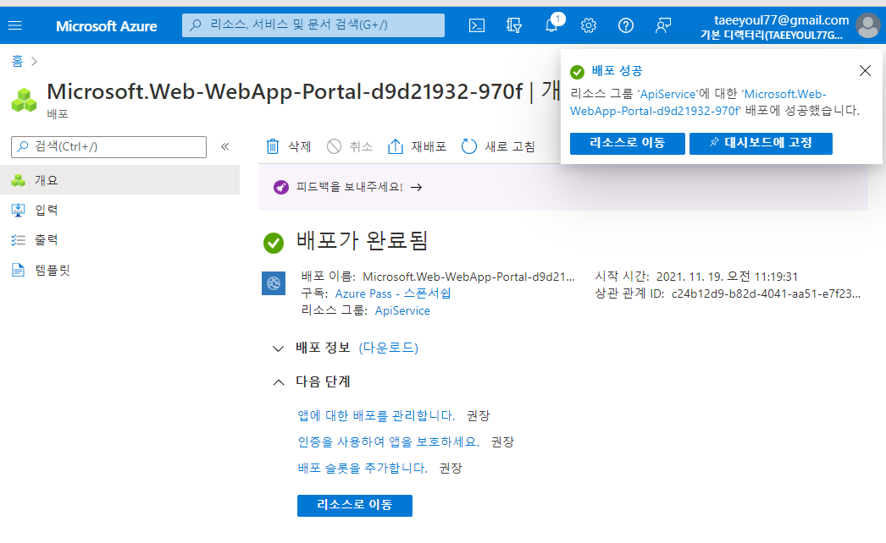

# 랩 08: Azure에서 서비스를 사용하여 다중 계층 솔루션 만들기

## 실습 1: Docker 컨테이너 이미지를 사용하여 Azure App Service 리소스 만들기

  

### 작업 2: httpbin 컨테이너 이미지를 사용하여 Azure App Service 리소스를 통해 웹앱 만들기
#### 웹앱 > 기본탭
- 리소스 그룹 : ApiService
- 이름 : httpapitaeyeol
- 게시 : Docker 컨테이너
- 운영 체제 : Linux
- 지역 : 미국 동부
- Linux 플랜(미국 동부) [East US] >  새로 만들기
  - 이름 : ApiPlan
  - (신규)ASP-ApiService-9d16
- SKU 및 크기 : 그대로 둠
  - Premium V2 P1v2
  - 210 총 ACU, 3.5GB 메모리
#### Docker 앱 > 기본탭 
- 옵션 : 단일 컨테이너
- 이미지 소스 : Docker Hub
- 액세스 형식 : 공개
- 이미지 및 태그 : kennethreitz/httpbin:latest
  
  
  


### 작업 3: httpbin 웹 애플리케이션 테스트
#### 리소스 그룹 > ApiService > httpapitaeyeol > "찾아보기" 선택 (Swagger 화면이 나옴)
- 응답 형식
- GET /xml
- 사용해 보십시오
- 실행
- 응답 본문 및 응답 헤더 텍스트 상자의 값을 관찰
- 요청 URL 텍스트 상자의 값을 관찰

  

#### App Services > 설정 > 속성
- URL : httpapitaeyeol.azurewebsites.net
    


## 연습 2: Azure API Management를 사용하여 API 프록시 계층 빌드

### 작업 1: API Management 리소스 만들기
#### 리소스 만들기 > API 관리 > 만들기 > API 관리 서비스
- 리소스 이름 : prodapitaeyeol
- 구독 : 기본값
- 리소스 그룹 : ApiService 
- 지역 : 미국 동부
- 조직 이름 : Contoso
- 관리자 전자 메일 : 기본값
- 가격 책정 계층 : 사용(99.9 SLA, %), Consumption(99.95% SLA)
- 검토 + 만들기


### 작업 2: 새 API 정의
#### 리소스 그룹 > ApiService > prodapitaeyeol > 새 API 정의 > 빈 API > 빈 API 만들기 창
- 표시 이름 :  HTTPBin API
- 이름 : httpbin-api
- 웹 서비스 URL : httpapitaeyeol.azurewebsites.net
- API URL 접미사 : 비워둠
- 만들기
  
  


#### 디자인 탭 > 작업 추가  
- 표시 이름 : Echo Headers  
- 이름 : echo-headers  
- URL 목록 : GET
- URL 텍스트 상자 :  /  
- 저장


#### 디자인 탭 > 모든 작업의 디자인 >  인바운드 처리 > 정책 추가  > 인바운드 정책 추가 > 헤더 설정 
- 이름 : source  
- 값 > 값 추가 :  azure-api-mgmt
- 작업 목록 > 추가
- 저장 


#### 디자인 탭 > Echo Headers

#### 에코 헤더의 디자인 > 백엔드
- 서비스 URL >  재정의 체크 박스 선택
- 서비스 URL 텍스트 상자 현재 값에 /headers 값을 추가
  - 참고: 예를 들어, 현재 값이 **http://httpapi*[yourname]*.azurewebsites.net**인 경우 새 값은 http://httpapi*[yourname]*.azurewebsites.net/headers입니다.
- 저장

#### 디자인 탭 > Echo Headers > 보내기


### 작업 3: API 응답 조작


## 연습 3: 구독 정리

### 작업 2: 리소스 그룹 삭제
```
az group delete --name ApiService --no-wait --yes
```