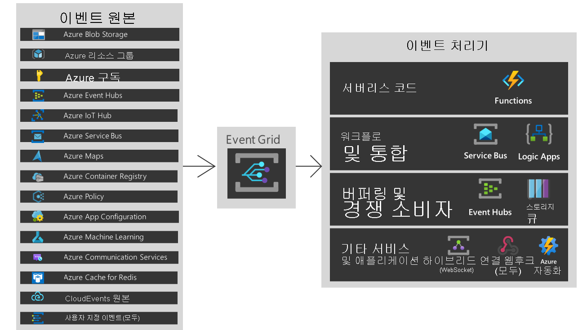
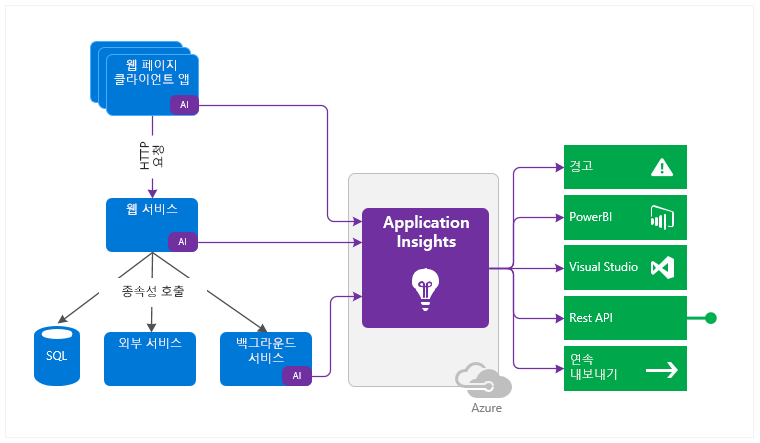
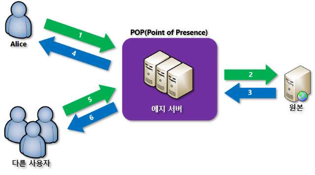

# 2021-11-19

## [API Management](API Management 설명서)
- Frontend API
- Backend API

### API Management 인스턴스 만들기
- API 생성 및 관리
- 각 api 에는 하나 이상의 작업 집합이 포함
- Git 를 사용하여 관리
- 고급 정책 시나리오 - mock response

### API 구성 인증
- 구독
- 클라이언트 인증서

## [Application Gateway](https://docs.microsoft.com/ko-kr/azure/azure-monitor/app/app-insights-overview)
- 전용 subnet 사용 (10.0.255.0/24)
- WAF
- L7 LB
- Kubernetes Ingress Controller 와 유사

## [Lab08](./Lab08.md)  

## Azure LogicApp
### 특징
- 코딩 없이 코딩하는 것
- 자동화 워크플로 솔루션
- JSON 기반 워크플로 정의
  - ARM 템플릿을 사용하여 배포 가능
### 구성요소
- 워크플로  
  - 일련의 단계로 서술된 비즈니스 프로세스
  - 트리거 -> 작업 -> 작업 -> 커넥터 -> 작업 -> 커넥터 -> 작업
- 트리거   
  - 새 워크플로 인스턴스를 호출할 단계
- 작업  
  - 워크플로의 개별 단계, 일반적으로 커넥터 또는 사용자 지정 API 앱
- 커넥터  
  - 특정 서비스 또는 데이터 원본과 통합할 준비가 되고 미리 빌드된 API 앱의 특별한 사례
  - Twitter
  - SQL Server Connetor
  - Azure Service Bus Connector
  - HDInsight Connector ...
  
### B2B 사나리오 및 엔터프라이즈 통합 팩
- 다양한 형식을 변환하는 특수 팩
  - 조직간 원활한 커뮤니케이션
  - 암호화 및 디지털 서명으로 메시지 보안
  - 친숙한 BizTalk
- 엔터프라이즈 통합을 사용해야 하는 이유 ?

### Visual Studio 을 사용하여 Logic App 만들기
- DevOps Pipeline 연계

### Browser : Logic Apps Designer
- workflow 를 시각적으로 작업 구성
- 동적 콘텐츠 사용
- 트리거 예약
- 스케줄링
- 일정 트리거 유형
  - 되풀이
  - 슬라이딩 윈도우
- 단일 실행(한번 실행)

### Logic 앱 만들기

### 사용자 지정 커넥터
### 배포 템플릿
- 버전 관리
- 기존 워크플로우에서 추출 가능
### 배포 템플릿 만들기
- Visual Studio 에서 JSON 추출
- PowerScript

### Lab09

---

## 이벤트 기반 아키텍처
- producers -> Event ingestion -> consumer

## [Azure Event Grid](https://docs.microsoft.com/ko-kr/azure/event-grid/overview)
- 이벤트 기반 아키텍처로 손쉽게 애플리케이션 빌드 가능
- 스토리지 Blob
- Event Sources -> Event Grid -> Event Handlers 

### 개념
- 이벤트 : 발생한 상황
- 이벤트 Source : 발생한 곳
- 토픽 : publisher 가 이벤트를 보내는 엔드포인트
- 이벤트 구독 : 이벤트를 하나 이상의 handler 로 경로 지정하는 끝점 또는 기본 제공 메커니즘. 구독은 handler 가 들어오는 이벤트를 지능적으로 필터링하는 데도 사용됨
- 이벤트 처리기 : 이벤트에 반으하는 앱 또는 서비스
- Sources -> Event -> Topics -> subscription -> Handlers


### 보안
- 웹후크 이벤트 전달 : HTTP Post 요청을 선택한 Endpoint(URL) 로 보냄
- 이벤트 구독 : RBAC 권한 사용
- 커스텀 토픽 게시 : SAS 또는 키 기반 인증 사용

### 필터링
- 이벤트 유형
  - Resource 삭제 등
- 제목
- 고급 : 데이터 필드의 값
  
### 커스텀 이벤트 제작
```
az provider register --name Microsoft.EventGrid
az provider show --namespace Microsoft.EventGrid --query "registrationState"
```

- 이벤트 뷰어, 스브스크립션 만들기 
```PowerShell
$myLocation="eastus2"
$myResourceGroup="taeyeolrg"
az group create -n $myResourceGroup -l $myLocation

az provider register --namespace Microsoft.EventGrid
az provider show --namespace Microsoft.EventGrid --query "registrationState"

az provider register --namespace Microsoft.EventGrid/topics/providers
az provider show --namespace Microsoft.EventGrid/topics/providers --query "registrationState"

$myTopicName="taeyeolctopic"
az eventgrid topic create --name $myTopicName -l $myLocation -g $myResourceGroup

https://github.com/Azure-Samples/azure-event-grid-viewer

$mySiteName="taeyeolsitename"
$mySiteURL="https://${mySiteName}.azurewebsites.net"
az deployment group create `
    -g $myResourceGroup `
    --template-uri "https://raw.githubusercontent.com/Azure-Samples/azure-event-grid-viewer/master/azuredeploy.json" `
    --parameters siteName=$mySiteName hostingPlanName=viewerhost
echo "Your web app URL: ${mySiteURL}"

# $mySiteName="taeyeolitename"
# $mySiteURL="https://${mySiteName}.azurewebsites.net"


$endpoint="${mySiteURL}/api/updates"
## $subId=$(az account show --subscription "" | jq -r '.id')
$subId="0aa01477-9ad1-4549-bacf-eac6035fa242"

az eventgrid event-subscription create `
--source-resource-id "/subscriptions/${subId}/resourceGroups/${myResourceGroup}/providers/Microsoft.EventGrid/topics/${myTopicName}" `
--name demoViewerSub `
--endpoint ${endpoint}


$endpoint=$(az eventgrid topic show --name $myTopicName -g $myResourceGroup --query "endpoint" --output tsv)
# $endpoing=https://taeyeolctopic.eastus2-1.eventgrid.azure.net/api/events
echo $endpoint
$key=$(az eventgrid topic key list --name $myTopicName -g $myResourceGroup --query "key1" --output tsv)
echo $key

curl -X POST -H "aeg-sas-key: $key" -d "$event" $endpoint
```
[실행결과](./azure-event-grid.md)

---

## [Azure Monitor](https://docs.microsoft.com/ko-kr/azure/azure-monitor/overview)  
- 통합 모니터링
- 데이터 기반 인사이트
- 워크플로 통합
- 애플리케이션, 운영 체계, 리소스, 구독, 테넌트, 사용자 지정 -> Metric, Log -> Insight, 시각화, 분석, 응답, 통합

### 모니터링
- Metric
- Log

### 경고
- 대상 리소스 -> 조건/논리 테스트 -> 작업 그룹(수행할 작업)/모니터 조건(경고)

### [Application Insighth](https://docs.microsoft.com/ko-kr/azure/azure-monitor/app/app-insights-overview)  
- 개발자 및 DevOps 전문가를 위한 확장 가능한 APM(애플리케이션 성능 관리) 서비스
  

#### 웹 페이지용 Application Insights
- 웹페이지 또는 애플리케이션 모니터링
- 스크립트를 사용하여 프러트 엔드 원격 분석 갭처 가능
  - 웹페이지 로드 시간 ...
- 세그먼트 분석 결과

#### 콘솔 애플리케이션용 Application Insights
#### 데스크톱 앱용 Application Insights  
- 패키지 설치
- Metric 설정


### 언어
- .NET
- Java
- JavaScript / Node.js


## Redis
- Key-Value
- 스키마를 사용하여 키를 논리 그룹으로 나누는 것을 권장
  - application:last_updated_string
  - grade:house
- Operation
  - GET
  - SET
  - GETSET
  - EXIST


### Azure Cache for Redis
- 서비스 티어
  - 기본
    - 단일 노드
  - 표준
    - 1 Maser 2 Slave, SLA 포함
  - 프리미엄
    - Scale-Out Cache 지원, 고급 지속성, 클러스터링

- Congiuration
  - 이름
  - 리소스 그룹
  - 위치
  - 가격 책정 계증
  - 가상 네트워크 지원
  - 클러스터링 지원
- Access 를 위해 필요한 것
  - 호스트 이름
  - 포트
  - 액세스 키

---

## CDN(콘텐츠 배달 네트워크)
- 사용자에게 웹 콘텐즈를 효율적으로 전달할 수 있는 분산 서버 네트워크
- 휴대폰 및 테블릿 같은 디바이스에 공용 정적 및 공유 콘텐츠 배달
- 정적 콘텐츠로만 구성된 전체 웹 사이트 제공

### [Azure CDN](https://docs.microsoft.com/ko-kr/azure/cdn/cdn-overview)  
- 고대역폭 콘텐츠 배달을 위한 글로벌 CDN 솔루션
- POP(Point-of-presence) 를 사용하는 다양한 네트워크 최적화
  - 지리적으로 가까운 서버 사용
  


