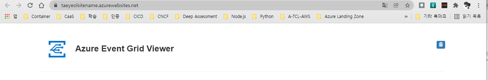
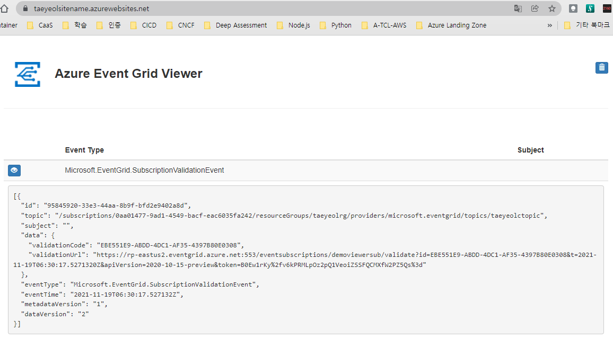

# Azure Event Grid 실행 결과


## Provider 등록
```
PS D:\workspace\AZ204> az provider register --name Microsoft.EventGrid

Registering is still on-going. You can monitor using 'az provider show -n Microsoft.EventGrid'
PS D:\workspace\AZ204> az provider show --namespace Microsoft.EventGrid --query "registrationState"

"Registering"
PS D:\workspace\AZ204> 
```

## topic 생성
```
PS D:\workspace\AZ204> $myTopicName="taeyeolctopic"

PS D:\workspace\AZ204> az eventgrid topic create --name $myTopicName -l $myLocation -g $myResourceGroup

{
  "endpoint": "https://taeyeolctopic.eastus2-1.eventgrid.azure.net/api/events",
  "extendedLocation": null,
  "id": "/subscriptions/0aa01477-9ad1-4549-bacf-eac6035fa242/resourceGroups/taeyeolrg/providers/Microsoft.EventGrid/topics/taeyeolctopic",
  "identity": {
    "principalId": null,
    "tenantId": null,
    "type": "None",
    "userAssignedIdentities": null
  },
  "inboundIpRules": null,
  "inputSchema": "EventGridSchema",
  "inputSchemaMapping": null,
  "kind": "Azure",
  "location": "eastus2",
  "metricResourceId": "da453c89-fe63-434b-ab17-86781cda501c",
  "name": "taeyeolctopic",
  "privateEndpointConnections": null,
  "provisioningState": "Succeeded",
  "publicNetworkAccess": "Enabled",
  "resourceGroup": "taeyeolrg",
  "sku": {
    "name": "Basic"
  },
  "systemData": null,
  "tags": null,
  "type": "Microsoft.EventGrid/topics"
}
PS D:\workspace\AZ204> 
```

## 
```
PS D:\workspace\AZ204> $mySiteName="taeyeolsitename"

PS D:\workspace\AZ204> $mySiteURL="https://${mySiteName}.azurewebsites.net"

PS D:\workspace\AZ204> az group deployment create `
>>     -g $myResourceGroup `
>>     --template-uri "https://raw.githubusercontent.com/Azure-Samples/azure-event-grid-viewer/master/azuredeploy.json" `
>>     --parameters siteName=$mySiteName hostingPlanName=viewerhost

This command is implicitly deprecated because command group 'group deployment' is deprecated and will be removed in a future release. Use 'deployment group' instead.
{
  "id": "/subscriptions/0aa01477-9ad1-4549-bacf-eac6035fa242/resourceGroups/taeyeolrg/providers/Microsoft.Resources/deployments/azuredeploy",
  "location": null,
  "name": "azuredeploy",
  "properties": {
    "correlationId": "530e23e5-3071-43b8-b2eb-d6e512d54e2e",
    "debugSetting": null,
    "dependencies": [
      {
        "dependsOn": [
          {
            "id": "/subscriptions/0aa01477-9ad1-4549-bacf-eac6035fa242/resourceGroups/taeyeolrg/providers/Microsoft.Web/serverfarms/viewerhost",
            "resourceGroup": "taeyeolrg",
            "resourceName": "viewerhost",
            "resourceType": "Microsoft.Web/serverfarms"
          }
        ],
        "id": "/subscriptions/0aa01477-9ad1-4549-bacf-eac6035fa242/resourceGroups/taeyeolrg/providers/Microsoft.Web/sites/taeyeolsitename",
        "resourceGroup": "taeyeolrg",
        "resourceName": "taeyeolsitename",
        "resourceType": "Microsoft.Web/sites"
      },
      {
        "dependsOn": [
          {
            "id": "/subscriptions/0aa01477-9ad1-4549-bacf-eac6035fa242/resourceGroups/taeyeolrg/providers/Microsoft.Web/Sites/taeyeolsitename",
            "resourceGroup": "taeyeolrg",
            "resourceName": "taeyeolsitename",
            "resourceType": "Microsoft.Web/Sites"
          }
        ],
        "id": "/subscriptions/0aa01477-9ad1-4549-bacf-eac6035fa242/resourceGroups/taeyeolrg/providers/Microsoft.Web/sites/taeyeolsitename/sourcecontrols/web",
        "resourceGroup": "taeyeolrg",
        "resourceName": "taeyeolsitename/web",
        "resourceType": "Microsoft.Web/sites/sourcecontrols"
      }
    ],
    "duration": "PT2M24.397274S",
    "error": null,
    "mode": "Incremental",
    "onErrorDeployment": null,
    "outputResources": [
      {
        "id": "/subscriptions/0aa01477-9ad1-4549-bacf-eac6035fa242/resourceGroups/taeyeolrg/providers/Microsoft.Web/serverfarms/viewerhost",
        "resourceGroup": "taeyeolrg"
      },
      {
        "id": "/subscriptions/0aa01477-9ad1-4549-bacf-eac6035fa242/resourceGroups/taeyeolrg/providers/Microsoft.Web/sites/taeyeolsitename",
        "resourceGroup": "taeyeolrg"
      },
      {
        "id": "/subscriptions/0aa01477-9ad1-4549-bacf-eac6035fa242/resourceGroups/taeyeolrg/providers/Microsoft.Web/sites/taeyeolsitename/sourcecontrols/web",
        "resourceGroup": "taeyeolrg"
      }
    ],
    "outputs": {
      "appServiceEndpoint": {
        "type": "String",
        "value": "https://taeyeolsitename.azurewebsites.net"
      }
    },
    "parameters": {
      "branch": {
        "type": "String",
        "value": "master"
      },
      "hostingPlanName": {
        "type": "String",
        "value": "viewerhost"
      },
      "location": {
        "type": "String",
        "value": "eastus"
      },
      "repoURL": {
        "type": "String",
        "value": "https://github.com/Azure-Samples/azure-event-grid-viewer.git"
      },
      "siteName": {
        "type": "String",
        "value": "taeyeolsitename"
      },
      "sku": {
        "type": "String",
        "value": "F1"
      }
    },
    "parametersLink": null,
    "providers": [
      {
        "id": null,
        "namespace": "Microsoft.Web",
        "registrationPolicy": null,
        "registrationState": null,
        "resourceTypes": [
          {
            "aliases": null,
            "apiProfiles": null,
            "apiVersions": null,
            "capabilities": null,
            "defaultApiVersion": null,
            "locationMappings": null,
            "locations": [
              "eastus"
            ],
            "properties": null,
            "resourceType": "serverfarms",
            "zoneMappings": null
          },
          {
            "aliases": null,
            "apiProfiles": null,
            "apiVersions": null,
            "capabilities": null,
            "defaultApiVersion": null,
            "locationMappings": null,
            "locations": [
              "eastus"
            ],
            "properties": null,
            "resourceType": "sites",
            "zoneMappings": null
          },
          {
            "aliases": null,
            "apiProfiles": null,
            "apiVersions": null,
            "capabilities": null,
            "defaultApiVersion": null,
            "locationMappings": null,
            "locations": [
              null
            ],
            "properties": null,
            "resourceType": "sites/sourcecontrols",
            "zoneMappings": null
          }
        ]
      }
    ],
    "provisioningState": "Succeeded",
    "templateHash": "13179642382602262021",
    "templateLink": {
      "contentVersion": "1.0.0.0",
      "id": null,
      "queryString": null,
      "relativePath": null,
      "uri": "https://raw.githubusercontent.com/Azure-Samples/azure-event-grid-viewer/master/azuredeploy.json"
    },
    "timestamp": "2021-11-19T05:14:05.650201+00:00",
    "validatedResources": null
  },
  "resourceGroup": "taeyeolrg",
  "tags": null,
  "type": "Microsoft.Resources/deployments"
}
PS D:\workspace\AZ204> echo "Your web app URL: ${mySiteURL}"

Your web app URL: https://taeyeolsitename.azurewebsites.net
```

```
PS D:\workspace\AZ204> $endpoint=$(az eventgrid topic show --name $myTopicName -g $myResourceGroup --query "endpoint" --output tsv)

PS D:\workspace\AZ204> echo $endpoint

https://taeyeolctopic.eastus2-1.eventgrid.azure.net/api/events
PS D:\workspace\AZ204> $key=$(az eventgrid topic key list --name $myTopicName -g $myResourceGroup --query "key1" --output tsv)

PS D:\workspace\AZ204> echo $key

diTFS2eNXr7P7tt+yHYNW4HNzvAxsEl2GfD1Ny8IYuY=
PS D:\workspace\AZ204> curl -X POST -H "aeg-sas-key: $key" -d "$event" $endpoint

curl: no URL specified!
curl: try 'curl --help' for more information
PS D:\workspace\AZ204> curl -X POST -H "aeg-sas-key: $key" -d "$event" $endpoint

curl: no URL specified!
curl: try 'curl --help' for more information
PS D:\workspace\AZ204> 
```

## 결과



### https://raw.githubusercontent.com/Azure-Samples/azure-event-grid-viewer/master/azuredeploy.json
```JSON
{
    "$schema": "https://schema.management.azure.com/schemas/2019-04-01/deploymentTemplate.json#",
    "contentVersion": "1.0.0.0",
    "parameters": {
      "siteName": {
        "type": "string",
        "metadata": {
          "description": "The name of the web app that you wish to create."
        }
      },
      "hostingPlanName": {
        "type": "string",
        "metadata": {
          "description": "The name of the App Service plan to use for hosting the web app."
        }
      },
      "sku": {
        "type": "string",
        "allowedValues": [
          "F1",
          "D1",
          "B1",
          "B2",
          "B3",
          "S1"
        ],
        "defaultValue": "F1",
        "metadata": {
          "description": "The pricing tier for the hosting plan."
        }
      },
      "repoURL": {
        "type": "string",
        "defaultValue": "https://github.com/Azure-Samples/azure-event-grid-viewer.git",
        "metadata": {
          "description": "The URL for the GitHub repository that contains the project to deploy."
        }
      },
      "branch": {
        "type": "string",
        "defaultValue": "master",
        "metadata": {
          "description": "The branch of the GitHub repository to use."
        }
      },
      "location": {
        "type": "string",
        "defaultValue": "[resourceGroup().location]",
        "metadata": {
          "description": "Location for all resources."
        }
      }
    },
    "resources": [
      {
        "apiVersion": "2015-08-01",
        "name": "[parameters('hostingPlanName')]",
        "type": "Microsoft.Web/serverfarms",
        "location": "[parameters('location')]",
        "sku": {
          "name": "[parameters('sku')]",
          "capacity": 0
        },
        "properties": {
          "name": "[parameters('hostingPlanName')]"
        }
      },
      {
        "apiVersion": "2015-08-01",
        "name": "[parameters('siteName')]",
        "type": "Microsoft.Web/sites",
        "location": "[parameters('location')]",
        "dependsOn": [
          "[resourceId('Microsoft.Web/serverfarms', parameters('hostingPlanName'))]"
        ],
        "properties": {
          "serverFarmId": "[parameters('hostingPlanName')]",
          "siteConfig": {
            "webSocketsEnabled": true         
          },
          "httpsOnly":true
        },
        "resources": [
          {
            "apiVersion": "2018-11-01",
            "name": "web",
            "type": "sourcecontrols",
            "dependsOn": [
              "[resourceId('Microsoft.Web/Sites', parameters('siteName'))]"
            ],
            "properties": {
              "RepoUrl": "[parameters('repoURL')]",
              "branch": "[parameters('branch')]",
              "IsManualIntegration": true
            }
          }
        ]
      }
    ],
    "outputs": {
        "appServiceEndpoint": {
            "type": "string",
            "value": "[concat('https://',reference(resourceId('Microsoft.Web/sites', parameters('siteName'))).hostNames[0])]"
        }
    }
  }
```

```
PS D:\workspace\AZ204> az eventgrid event-subscription create `
>> --source-resource-id "/subscriptions/${subId}/resourceGroups/${myResourceGroup}/providers/Microsoft.EventGrid/topics/${myTopicName}" `
>> --name demoViewerSub `
>> --endpoint ${endpoint}

If you are creating an event subscription from a topic that has “Azure” as the value for its “kind” property, you must validate your webhook endpoint by following the steps described in https://aka.ms/eg-webhook-endpoint-validation.
{
  "deadLetterDestination": null,
  "deadLetterWithResourceIdentity": null,
  "deliveryWithResourceIdentity": null,
  "destination": {
    "azureActiveDirectoryApplicationIdOrUri": null,
    "azureActiveDirectoryTenantId": null,
    "deliveryAttributeMappings": null,
    "endpointBaseUrl": "https://taeyeolsitename.azurewebsites.net/api/updates",
    "endpointType": "WebHook",
    "endpointUrl": null,
    "maxEventsPerBatch": 1,
    "preferredBatchSizeInKilobytes": 64
  },
  "eventDeliverySchema": "EventGridSchema",
  "expirationTimeUtc": null,
  "filter": {
    "advancedFilters": null,
    "enableAdvancedFilteringOnArrays": null,
    "includedEventTypes": null,
    "isSubjectCaseSensitive": null,
    "subjectBeginsWith": "",
    "subjectEndsWith": ""
  },
  "id": "/subscriptions/0aa01477-9ad1-4549-bacf-eac6035fa242/resourceGroups/taeyeolrg/providers/Microsoft.EventGrid/topics/taeyeolctopic/providers/Microsoft.EventGrid/eventSubscriptions/demoViewerSub",
  "labels": null,
  "name": "demoViewerSub",
  "provisioningState": "Succeeded",
  "resourceGroup": "taeyeolrg",
  "retryPolicy": {
    "eventTimeToLiveInMinutes": 1440,
    "maxDeliveryAttempts": 30
  },
  "systemData": null,
  "topic": "/subscriptions/0aa01477-9ad1-4549-bacf-eac6035fa242/resourceGroups/taeyeolrg/providers/microsoft.eventgrid/topics/taeyeolctopic",
  "type": "Microsoft.EventGrid/eventSubscriptions"
}
PS D:\workspace\AZ204> 
```

```
```