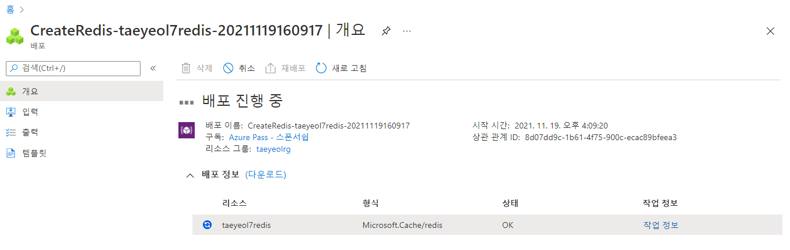
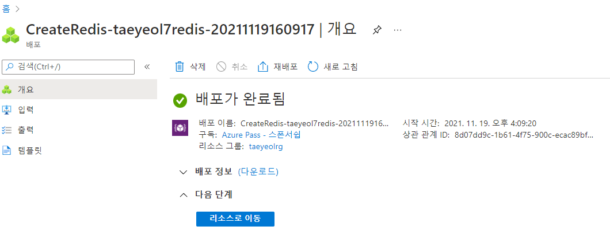
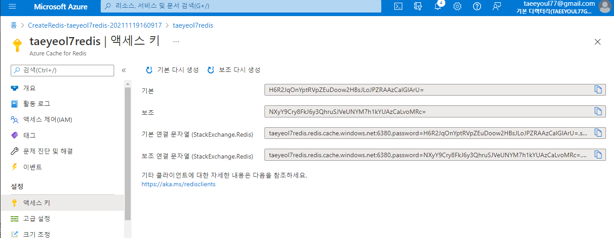

# Azure Cache for Redis 실습결과

## 실습 내용
```
az group create -n taeyeolrg -l eastus 
az redis create -l eastus -g taeyeolrg -l eastus -n taeyeolredis --sku Basic --vm-size c0
 
dotnet new console -f netcoreapp3.1
dotnet add package StackExchange.Redis 
Install-Package StackExchange.Redis
```

- Program.cs
```C#

using System;
using StackExchange.Redis;
using System.Threading.Tasks;

namespace DemoRedis
{
    class Program
    {
        static async Task Main(string[] args)
        {

            string connectionString = "taeyeol7redis.redis.cache.windows.net:6380,password=H6R2JqOnYptRVpZEuDoow2HBsJLoJPZRAAzCaIGlArU=,ssl=True,abortConnect=False";
            using (var cache = ConnectionMultiplexer.Connect(connectionString))
            {
                IDatabase db = cache.GetDatabase();
                bool setValue = await db.StringSetAsync("test:key", "100");
                Console.WriteLine($"SET: {setValue}");

                string getValue = await db.StringGetAsync("test:key");
                Console.WriteLine($"GET: {getValue}");

                var result = await db.ExecuteAsync("ping");
                Console.WriteLine($"PING = {result.Type} : {result}");

                result = await db.ExecuteAsync("flushdb");
                Console.WriteLine($"FLUSHDB = {result.Type} : {result}");

            }

            Console.WriteLine("Hello World!");
        }
    }
}
```

## 실행결과
### Redis 만들기
```
PS D:\workspace\AZ204\2021-11-19\redis> az redis create -l eastus -g taeyeolrg -l eastus -n taeyeolredis --sku Basic --vm-size c0

The resource '/subscriptions/0aa01477-9ad1-4549-bacf-eac6035fa242/resourceGroups/taeyeolrg/providers/Microsoft.Cache/Redis/taeyeolredis' is busy processing a previous update request 
or is undergoing system maintenance.  As such, it is currently unable to accept the update request.  Please try again later.
RequestID=b37f22b0-24b8-4219-8aff-b6e0cbdcf9df
PS D:\workspace\AZ204\2021-11-19\redis> az redis list -g taeyeolrg -o table

EnableNonSslPort    HostName                              Location    Name          Port    ProvisioningState    RedisVersion    ResourceGroup    SslPort
------------------  ------------------------------------  ----------  ------------  ------  -------------------  --------------  ---------------  ---------
False               taeyeolredis.redis.cache.windows.net  East US     taeyeolredis  6379    Creating             4.0.14          taeyeolrg        6380
PS D:\workspace\AZ204\2021-11-19\redis> 
```
  
  



### dotnet "redis" 프로젝트 생성 및 package 추가
```
D:\workspace\AZ204\2021-11-19\redis\redis.csproj에서 'dotnet restore' 실행 중 ...
  복원할 프로젝트를 확인하는 중...
  D:\workspace\AZ204\2021-11-19\redis\redis.csproj을(를) 168 ms 동안 복원했습니다.
복원에 성공했습니다.

PS D:\workspace\AZ204\2021-11-19\redis> dotnet add package StackExchange.Redis 

  복원할 프로젝트를 확인하는 중...
  Writing C:\Users\Administrator\AppData\Local\Temp\tmp43E2.tmp
info : 'D:\workspace\AZ204\2021-11-19\redis\redis.csproj' 프로젝트에 'StackExchange.Redis' 패키지에 대한 PackageReference를 추가하는 중입니다.
info :   GET https://api.nuget.org/v3/registration5-gz-semver2/stackexchange.redis/index.json
info :   OK https://api.nuget.org/v3/registration5-gz-semver2/stackexchange.redis/index.json 720밀리초
info :   GET https://api.nuget.org/v3/registration5-gz-semver2/stackexchange.redis/page/1.0.187/1.2.4.json
info :   OK https://api.nuget.org/v3/registration5-gz-semver2/stackexchange.redis/page/1.0.187/1.2.4.json 736밀리초
info :   GET https://api.nuget.org/v3/registration5-gz-semver2/stackexchange.redis/page/1.2.5/2.2.88.json
info :   OK https://api.nuget.org/v3/registration5-gz-semver2/stackexchange.redis/page/1.2.5/2.2.88.json 768밀리초
info : D:\workspace\AZ204\2021-11-19\redis\redis.csproj의 패키지를 복원하는 중...
info :   GET https://api.nuget.org/v3-flatcontainer/stackexchange.redis/index.json
info :   OK https://api.nuget.org/v3-flatcontainer/stackexchange.redis/index.json 728밀리초
info :   GET https://api.nuget.org/v3-flatcontainer/stackexchange.redis/2.2.88/stackexchange.redis.2.2.88.nupkg
info :   OK https://api.nuget.org/v3-flatcontainer/stackexchange.redis/2.2.88/stackexchange.redis.2.2.88.nupkg 36밀리초
info :   GET https://api.nuget.org/v3-flatcontainer/pipelines.sockets.unofficial/index.json
info :   GET https://api.nuget.org/v3-flatcontainer/system.diagnostics.performancecounter/index.json
info :   OK https://api.nuget.org/v3-flatcontainer/pipelines.sockets.unofficial/index.json 703밀리초
info :   GET https://api.nuget.org/v3-flatcontainer/pipelines.sockets.unofficial/2.2.0/pipelines.sockets.unofficial.2.2.0.nupkg
info :   OK https://api.nuget.org/v3-flatcontainer/pipelines.sockets.unofficial/2.2.0/pipelines.sockets.unofficial.2.2.0.nupkg 84밀리초
info :   OK https://api.nuget.org/v3-flatcontainer/system.diagnostics.performancecounter/index.json 820밀리초
info :   GET https://api.nuget.org/v3-flatcontainer/system.diagnostics.performancecounter/5.0.0/system.diagnostics.performancecounter.5.0.0.nupkg
info :   OK https://api.nuget.org/v3-flatcontainer/system.diagnostics.performancecounter/5.0.0/system.diagnostics.performancecounter.5.0.0.nupkg 36밀리초
info :   GET https://api.nuget.org/v3-flatcontainer/microsoft.netcore.platforms/index.json
info :   GET https://api.nuget.org/v3-flatcontainer/system.io.pipelines/index.json
info :   GET https://api.nuget.org/v3-flatcontainer/microsoft.win32.registry/index.json
info :   GET https://api.nuget.org/v3-flatcontainer/system.configuration.configurationmanager/index.json
info :   GET https://api.nuget.org/v3-flatcontainer/system.security.principal.windows/index.json
info :   OK https://api.nuget.org/v3-flatcontainer/system.io.pipelines/index.json 211밀리초
info :   GET https://api.nuget.org/v3-flatcontainer/system.io.pipelines/5.0.0/system.io.pipelines.5.0.0.nupkg
info :   OK https://api.nuget.org/v3-flatcontainer/system.io.pipelines/5.0.0/system.io.pipelines.5.0.0.nupkg 36밀리초
info :   OK https://api.nuget.org/v3-flatcontainer/microsoft.netcore.platforms/index.json 716밀리초
info :   GET https://api.nuget.org/v3-flatcontainer/microsoft.netcore.platforms/5.0.0/microsoft.netcore.platforms.5.0.0.nupkg
info :   OK https://api.nuget.org/v3-flatcontainer/microsoft.netcore.platforms/5.0.0/microsoft.netcore.platforms.5.0.0.nupkg 35밀리초
info :   OK https://api.nuget.org/v3-flatcontainer/system.security.principal.windows/index.json 809밀리초
info :   OK https://api.nuget.org/v3-flatcontainer/microsoft.win32.registry/index.json 814밀리초
info :   GET https://api.nuget.org/v3-flatcontainer/system.security.principal.windows/5.0.0/system.security.principal.windows.5.0.0.nupkg
info :   GET https://api.nuget.org/v3-flatcontainer/microsoft.win32.registry/5.0.0/microsoft.win32.registry.5.0.0.nupkg
info :   OK https://api.nuget.org/v3-flatcontainer/system.configuration.configurationmanager/index.json 853밀리초
info :   GET https://api.nuget.org/v3-flatcontainer/system.configuration.configurationmanager/5.0.0/system.configuration.configurationmanager.5.0.0.nupkg
info :   OK https://api.nuget.org/v3-flatcontainer/system.security.principal.windows/5.0.0/system.security.principal.windows.5.0.0.nupkg 36밀리초
info :   OK https://api.nuget.org/v3-flatcontainer/microsoft.win32.registry/5.0.0/microsoft.win32.registry.5.0.0.nupkg 36밀리초
info :   OK https://api.nuget.org/v3-flatcontainer/system.configuration.configurationmanager/5.0.0/system.configuration.configurationmanager.5.0.0.nupkg 39밀리초
info :   GET https://api.nuget.org/v3-flatcontainer/system.security.accesscontrol/index.json
info :   GET https://api.nuget.org/v3-flatcontainer/system.security.cryptography.protecteddata/index.json
info :   GET https://api.nuget.org/v3-flatcontainer/system.security.permissions/index.json
info :   OK https://api.nuget.org/v3-flatcontainer/system.security.permissions/index.json 718밀리초
info :   GET https://api.nuget.org/v3-flatcontainer/system.security.permissions/5.0.0/system.security.permissions.5.0.0.nupkg
info :   OK https://api.nuget.org/v3-flatcontainer/system.security.cryptography.protecteddata/index.json 728밀리초
info :   GET https://api.nuget.org/v3-flatcontainer/system.security.cryptography.protecteddata/5.0.0/system.security.cryptography.protecteddata.5.0.0.nupkg
info :   OK https://api.nuget.org/v3-flatcontainer/system.security.permissions/5.0.0/system.security.permissions.5.0.0.nupkg 38밀리초
info :   OK https://api.nuget.org/v3-flatcontainer/system.security.cryptography.protecteddata/5.0.0/system.security.cryptography.protecteddata.5.0.0.nupkg 35밀리초
info :   GET https://api.nuget.org/v3-flatcontainer/system.windows.extensions/index.json
info :   OK https://api.nuget.org/v3-flatcontainer/system.windows.extensions/index.json 704밀리초
info :   GET https://api.nuget.org/v3-flatcontainer/system.windows.extensions/5.0.0/system.windows.extensions.5.0.0.nupkg
info :   OK https://api.nuget.org/v3-flatcontainer/system.windows.extensions/5.0.0/system.windows.extensions.5.0.0.nupkg 39밀리초
info :   GET https://api.nuget.org/v3-flatcontainer/system.drawing.common/index.json
info :   OK https://api.nuget.org/v3-flatcontainer/system.drawing.common/index.json 717밀리초
info :   GET https://api.nuget.org/v3-flatcontainer/system.drawing.common/5.0.0/system.drawing.common.5.0.0.nupkg
info :   OK https://api.nuget.org/v3-flatcontainer/system.drawing.common/5.0.0/system.drawing.common.5.0.0.nupkg 40밀리초
info :   GET https://api.nuget.org/v3-flatcontainer/microsoft.win32.systemevents/index.json
info :   OK https://api.nuget.org/v3-flatcontainer/microsoft.win32.systemevents/index.json 690밀리초
info :   GET https://api.nuget.org/v3-flatcontainer/microsoft.win32.systemevents/5.0.0/microsoft.win32.systemevents.5.0.0.nupkg
info :   OK https://api.nuget.org/v3-flatcontainer/microsoft.win32.systemevents/5.0.0/microsoft.win32.systemevents.5.0.0.nupkg 39밀리초
info :   OK https://api.nuget.org/v3-flatcontainer/system.security.accesscontrol/index.json 4969밀리초
info :   GET https://api.nuget.org/v3-flatcontainer/system.security.accesscontrol/5.0.0/system.security.accesscontrol.5.0.0.nupkg
info :   OK https://api.nuget.org/v3-flatcontainer/system.security.accesscontrol/5.0.0/system.security.accesscontrol.5.0.0.nupkg 38밀리초
info : 콘텐츠 해시 VyPlqzH2wavqquTcYpkIIAQ6WdenuKoFN0BdYBbCWsclXacSOHNQn66Gt4z5NBqEYW0FAPm5rlvki9ZiCij5xQ==을(를) 사용하여 https://api.nuget.org/v3/index.json에서 Microsoft.NETCore.Platforms 5.0.0을(를) 설치했습니다.
info : 콘텐츠 해시 c1ho9WU9ZxMZawML+ssPKZfdnrg/OjR3pe0m9v8230z3acqphwvPJqzAkH54xRYm5ntZHGG1EPP3sux9H3qSPg==을(를) 사용하여 https://api.nuget.org/v3/index.json에서 System.Windows.Extensions 5.0.0을(를) 설치했습니다.
info : 콘텐츠 해시 aM7cbfEfVNlEEOj3DsZP+2g9NRwbkyiAv2isQEzw7pnkDg9ekCU2m1cdJLM02Uq691OaCS91tooaxcEn8d0q5w==을(를) 사용하여 https://api.nuget.org/v3/index.json에서 System.Configuration.ConfigurationManager 5.0.0을(를) 설치했습니다.
info : 콘텐츠 해시 Bh6blKG8VAKvXiLe2L+sEsn62nc1Ij34MrNxepD2OCrS5cpCwQa9MeLyhVQPQ/R4Wlzwuy6wMK8hLb11QPDRsQ==을(를) 사용하여 https://api.nuget.org/v3/index.json에서 Microsoft.Win32.SystemEvents 5.0.0을(를) 설치했습니다.
info : 콘텐츠 해시 irMYm3vhVgRsYvHTU5b2gsT2CwT/SMM6LZFzuJjpIvT5Z4CshxNsaoBC1X/LltwuR3Opp8d6jOS/60WwOb7Q2Q==을(를) 사용하여 https://api.nuget.org/v3/index.json에서 System.IO.Pipelines 5.0.0을(를) 설치했습니다.
info : 콘텐츠 해시 7hzHplEIVOGBl5zOQZGX/DiJDHjq+RVRVrYgDiqXb6RriqWAdacXxp+XO9WSrATCEXyNOUOQg9aqQArsjase/A==을(를) 사용하여 https://api.nuget.org/v3/index.json에서 Pipelines.Sockets.Unofficial 2.2.0을(를) 설치했습니다.
info : 콘텐츠 해시 uE8juAhEkp7KDBCdjDIE3H9R1HJuEHqeqX8nLX9gmYKWwsqk3T5qZlPx8qle5DPKimC/Fy3AFTdV7HamgCh9qQ==을(를) 사용하여 https://api.nuget.org/v3/index.json에서 System.Security.Permissions 5.0.0을(를) 설치했습니다.
info : 콘텐츠 해시 JJi1jcO3/ZiamBhlsC/TR8aZmYf+nqpGzMi0HRRCy5wJkUPmMnRp0kBA6V84uhU8b531FHSdTDaFCAyCUJomjA==을(를) 사용하여 https://api.nuget.org/v3/index.json에서 StackExchange.Redis 2.2.88을(를) 설치했습니다.
info : 콘텐츠 해시 kcQWWtGVC3MWMNXdMDWfrmIlFZZ2OdoeT6pSNVRtk9+Sa7jwdPiMlNwb0ZQcS7NRlT92pCfmjRtkSWUW3RAKwg==을(를) 사용하여 https://api.nuget.org/v3/index.json에서 System.Diagnostics.PerformanceCounter 5.0.0을(를) 설치했습니다.
info : 콘텐츠 해시 dDoKi0PnDz31yAyETfRntsLArTlVAVzUzCIvvEDsDsucrl33Dl8pIJG06ePTJTI3tGpeyHS9Cq7Foc/s4EeKcg==을(를) 사용하여 https://api.nuget.org/v3/index.json에서 Microsoft.Win32.Registry 5.0.0을(를) 설치했습니다.
info : 콘텐츠 해시 dagJ1mHZO3Ani8GH0PHpPEe/oYO+rVdbQjvjJkBRNQkX4t0r1iaeGn8+/ybkSLEan3/slM0t59SVdHzuHf2jmw==을(를) 사용하여 https://api.nuget.org/v3/index.json에서 System.Security.AccessControl 5.0.0을(를) 설치했습니다.
info : 콘텐츠 해시 SztFwAnpfKC8+sEKXAFxCBWhKQaEd97EiOL7oZJZP56zbqnLpmxACWA8aGseaUExciuEAUuR9dY8f7HkTRAdnw==을(를) 사용하여 https://api.nuget.org/v3/index.json에서 System.Drawing.Common 5.0.0을(를) 설치했습니다.
info : 콘텐츠 해시 HGxMSAFAPLNoxBvSfW08vHde0F9uh7BjASwu6JF9JnXuEPhCY3YUqURn0+bQV/4UWeaqymmrHWV+Aw9riQCtCA==을(를) 사용하여 https://api.nuget.org/v3/index.json에서 System.Security.Cryptography.ProtectedData 5.0.0을(를) 설치했습니다.
info : 콘텐츠 해시 t0MGLukB5WAVU9bO3MGzvlGnyJPgUlcwerXn1kzBRjwLKixT96XV0Uza41W49gVd8zEMFu9vQEFlv0IOrytICA==을(를) 사용하여 https://api.nuget.org/v3/index.json에서 System.Security.Principal.Windows 5.0.0을(를) 설치했습니다.
info : 'StackExchange.Redis' 패키지는 'D:\workspace\AZ204\2021-11-19\redis\redis.csproj' 프로젝트에 지정된 모든 프레임워크와 호환됩니다.
info : 'StackExchange.Redis' 패키지 '2.2.88' 버전에 대한 PackageReference가 'D:\workspace\AZ204\2021-11-19\redis\redis.csproj' 파일에 추가되었습니다.
info : 복원을 커밋하는 중...
info : 자산 파일을 디스크에 쓰는 중입니다. 경로: D:\workspace\AZ204\2021-11-19\redis\obj\project.assets.json
log  : D:\workspace\AZ204\2021-11-19\redis\redis.csproj을(를) 11.58 sec 동안 복원했습니다.
PS D:\workspace\AZ204\2021-11-19\redis> 
```

## 빌드
```
PS D:\workspace\AZ204\2021-11-19\redis> dotnet build .

.NET용 Microsoft (R) Build Engine 버전 17.0.0+c9eb9dd64
Copyright (C) Microsoft Corporation. All rights reserved.

  복원할 프로젝트를 확인하는 중...
  복원할 모든 프로젝트가 최신 상태입니다.
  redis -> D:\workspace\AZ204\2021-11-19\redis\bin\Debug\net6.0\redis.dll

빌드했습니다.
    경고 0개
    오류 0개

경과 시간: 00:00:06.81
```

### 실행
#### 정상동작(생성 후 연결문자열 넣고 build & run)
```
PS D:\workspace\AZ204\2021-11-19\redis> dotnet build .

.NET용 Microsoft (R) Build Engine 버전 17.0.0+c9eb9dd64
Copyright (C) Microsoft Corporation. All rights reserved.

  복원할 프로젝트를 확인하는 중...
  복원할 모든 프로젝트가 최신 상태입니다.
  redis -> D:\workspace\AZ204\2021-11-19\redis\bin\Debug\net6.0\redis.dll

빌드했습니다.
    경고 0개
    오류 0개

경과 시간: 00:00:04.60
PS D:\workspace\AZ204\2021-11-19\redis> dotnet run   

SET: True
GET: 100
PING = SimpleString : PONG
FLUSHDB = SimpleString : OK
Hello World!
PS D:\workspace\AZ204\2021-11-19\redis> 
```

#### Redis 생성중 (생성시 시간이 오래 걸림)  
```
PS D:\workspace\AZ204\2021-11-19\redis> dotnet run

Unhandled exception. StackExchange.Redis.RedisConnectionException: It was not possible to connect to the redis server(s). Error connecting right now. To allow this multiplexer to continue retrying until it's able to connect, use abortConnect=false in your connection string or AbortOnConnectFail=false; in your code.
   at StackExchange.Redis.ConnectionMultiplexer.ConnectImpl(ConfigurationOptions configuration, TextWriter log) in /_/src/StackExchange.Redis/ConnectionMultiplexer.cs:line 1194      
   at StackExchange.Redis.ConnectionMultiplexer.Connect(ConfigurationOptions configuration, TextWriter log) in /_/src/StackExchange.Redis/ConnectionMultiplexer.cs:line 1061
   at StackExchange.Redis.ConnectionMultiplexer.Connect(String configuration, TextWriter log) in /_/src/StackExchange.Redis/ConnectionMultiplexer.cs:line 1036
   at DemoRedis.Program.Main(String[] args) in D:\workspace\AZ204\2021-11-19\redis\Program.cs:line 13
   at DemoRedis.Program.<Main>(String[] args)
PS D:\workspace\AZ204\2021-11-19\redis> 
```