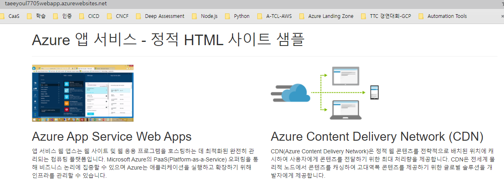

# AZ 204

## 준비
> [Microsoft Learning](https://github.com/MicrosoftLearning)  
> [Azure에서 클라우드 스토리지 관리](https://azure.microsoft.com/ko-kr/features/storage-explorer/#overview)  
> [git](https://1drv.ms/u/s!AmlADRmU8M8uk_h_GY-jXnm09_asPg?e=c0BjUn)  
> [HttpRepl](https://github.com/dotnet/HttpRepl)  
- .NET Core가 지원되는 모든 곳에서 지원되는 가벼운 플랫폼 간 명령줄 도구입니다.
- ASP.NET Core 웹 API를 테스트하고 결과를 보기 위한 HTTP 요청을 만드는 데 사용됩니다.

TechSkillsSupport@microsoft.com
Delivery ID : 33786
2021년 11월 15일~
AZ-204 Developing Solutions for Microsoft Azure
[one drive - 강의 자료](https://1drv.ms/u/s!AmlADRmU8M8uk_h_GY-jXnm09_asPg?e=c0BjUn)  
[AZ-204: Microsoft Azure 솔루션 개발 - GitHub](https://github.com/MicrosoftLearning/AZ-204KO-DevelopingSolutionsforMicrosoftAzure)  
[AZ-204 영문자료 - GitHub](https://github.com/MicrosoftLearning/AZ-204-DevelopingSolutionsforMicrosoftAzure.git)  

https://teams.microsoft.com/l/meetup-join/19%3ameeting_NjE0MmMzMmQtOWRlZi00MjZiLTllYTYtMGRjMzQ3YzUwMGQy%40thread.v2/0?context=%7b%22Tid%22%3a%2272f988bf-86f1-41af-91ab-2d7cd011db47%22%2c%22Oid%22%3a%22c5825cfd-a05b-4288-8c3d-cec2cf365dd6%22%7d

https://dotnet.microsoft.com/download
https://dotnet.microsoft.com/download/dotnet/3.1
https://code.visualstudio.com/download#

dotnet --version
mkdir sample01
cd sample01
dotnet new
#dotnet new mvc
dotnet new mvc -f netcoreapp3.1 #3.1버전을 지정해서 생성
dotnet restore
dotnet build
code .   

## 11 시 강의 내용
https://filezilla-project.org/download.php?show_all=1
https://git-scm.com/downloads

https://github.com/MicrosoftLearning/AZ-204KO-DevelopingSolutionsforMicrosoftAzure

git config --global user.name "John Doe"
git config --global user.email johndoe@example.com

https://docs.microsoft.com/ko-kr/learn/certifications/

https://esi.learnondemand.net/
교육키 : 794419154814457D

https://azure.microsoft.com/ko-kr/free/

## Azure CLI 를 통해서 웹 앱 만들기 (Local Git 연동 배포)
```
# Azure CLI (PowerShell)
$gitrepo="https://github.com/Azure-Samples/php-docs-hello-world"
$myresourcegroup="taeeyoul77rg"
$webappplan="taeeyoul77asp"
$webappname="taeeyoul77webapp"

# Create a resource group.
az group create --location eastus2 --name $myresourcegroup
# Create an App Service plan in `FREE` tier. 
az appservice plan create --name $webappplan --resource-group $myresourcegroup --sku FREE
# Create a web app. 
az webapp create --name $webappname --resource-group $myresourcegroup --plan $webappplan
# Deploy code from a public GitHub repository. 
az webapp deployment source config --name $webappname --resource-group $myresourcegroup --repo-url $gitrepo --branch master --manual-integration 

# Azure PowerShell (PowerShell)
# Replace the following URL with a public GitHub repo URL 
$gitrepo="https://github.com/hahaysh/Azure-Samples.git" 
$myresourcegroup="taeeyoul77rg"
#$webappname="mywebapp$(Get-Random)" 
$webappname="taeeyoul77webapp"
$webappplan="taeeyoul77asp"
$location="East US2" 

# Create a resource group. 
New-AzResourceGroup -Name $myresourcegroup -Location $location 

# Create an App Service plan in Free tier. 
New-AzAppServicePlan -Name $webappplan -Location $location -ResourceGroupName $myresourcegroup -Tier Free 

# Create a web app. 
New-AzWebApp -Name $webappname -Location $location -AppServicePlan $webappplan -ResourceGroupName $myresourcegroup 

# Configure GitHub deployment from your GitHub repo and deploy once. 
$PropertiesObject = @{
  repoUrl = "$gitrepo";
  branch = "master";
  isManualIntegration = "true"; 
} 
Set-AzResource -PropertyObject $PropertiesObject -ResourceGroupName $myresourcegroup -ResourceType Microsoft.Web/sites/sourcecontrols -ResourceName $webappname/web -ApiVersion 2015-08-01 -Force
```

```
# 샘플 Download 
# Azure Cloud Shell 접속
mkdir demoHTML
cd $HOME/demoHTML
git clone https://github.com/Azure-Samples/html-docs-hello-world.git
cd html-docs-hello-world/

# Web App 만들기
az webapp up --resource-group taeeyoul77rg  --location eastus2 --name taeeyoul7705webapp --html

# 만들어지고 난 뒤에 접속 확인
https://taeeyoul7705webapp.azurewebsites.net/

# Web App 업데이트 후 재배포
code .
index.html 파일 제목 적당히 변경 저장

# Redeploy
az webapp up --resource-group taeeyoul77rg --location eastus2 --name taeeyoul7705webapp --html
```


### 실행결과
```
PS /home/seo> mkdir demoHTML
PS /home/seo> cd demoHTML
PS /home/seo/demoHTML> git clone https://github.com/Azure-Samples/html-docs-hello-world.git
Cloning into 'html-docs-hello-world'...
remote: Enumerating objects: 46, done.
remote: Total 46 (delta 0), reused 0 (delta 0), pack-reused 46
Unpacking objects: 100% (46/46), done.
PS /home/seo/demoHTML> ls -lt
total 4
drwxr-xr-x 7 seo seo 4096 Nov 15 06:12 html-docs-hello-world
PS /home/seo/demoHTML> cd *
PS /home/seo/demoHTML/html-docs-hello-world> ls
css  fonts  img  index.html  js  LICENSE  README.md
PS /home/seo/demoHTML/html-docs-hello-world> az webapp up --resource-group taeeyoul77rg  --location eastus2 --name taeeyoul7705webapp --html
The webapp 'taeeyoul7705webapp' doesn't exist
Creating AppServicePlan 'taeeyoul77_asp_Windows_eastus2_0' ...


Creating webapp 'taeeyoul7705webapp' ...
Configuring default logging for the app, if not already enabled
Creating zip with contents of dir /home/seo/demoHTML/html-docs-hello-world ...
Getting scm site credentials for zip deployment
Starting zip deployment. This operation can take a while to complete ...
Deployment endpoint responded with status code 202
You can launch the app at http://taeeyoul7705webapp.azurewebsites.net
{
  "URL": "http://taeeyoul7705webapp.azurewebsites.net",
  "appserviceplan": "taeeyoul77_asp_Windows_eastus2_0",
  "location": "eastus2",
  "name": "taeeyoul7705webapp",
  "os": "Windows",
  "resourcegroup": "taeeyoul77rg",
  "runtime_version": "-",
  "runtime_version_detected": "-",
  "sku": "FREE",
  "src_path": "//home//seo//demoHTML//html-docs-hello-world"
}
PS /home/seo/demoHTML/html-docs-hello-world> vi index.html
PS /home/seo/demoHTML/html-docs-hello-world> az webapp up --resource-group taeeyoul77rg --location eastus2 --name taeeyoul7705webapp --html
Webapp 'taeeyoul7705webapp' already exists. The command will deploy contents to the existing app.
Creating AppServicePlan 'taeeyoul77_asp_Windows_eastus2_0' ...
Creating zip with contents of dir /home/seo/demoHTML/html-docs-hello-world ...
Getting scm site credentials for zip deployment
Starting zip deployment. This operation can take a while to complete ...
Deployment endpoint responded with status code 202
You can launch the app at http://taeeyoul7705webapp.azurewebsites.net
{
  "URL": "http://taeeyoul7705webapp.azurewebsites.net",
  "appserviceplan": "taeeyoul77_asp_Windows_eastus2_0",
  "location": "eastus2",
  "name": "taeeyoul7705webapp",
  "os": "Windows",
  "resourcegroup": "taeeyoul77rg",
  "runtime_version": "-",
  "runtime_version_detected": "-",
  "sku": "FREE",
  "src_path": "//home//seo//demoHTML//html-docs-hello-world"
}
PS /home/seo/demoHTML/html-docs-hello-world>
```
```
az webapp show --resource-group taeeyoul77rg --name taeeyoul7705webapp --query outboundIpAddresses --output tsv
az webapp show --resource-group taeeyoul77rg --name taeeyoul7705webapp --query possibleOutboundIpAddresses --output tsv
```



- git clone 오류시 계정을 앞에 넣어줌
https://hahaysh3@hahaysh02webapp.scm.azurewebsites.net:443/hahaysh02webapp.git

## 단원 03: App Service 앱 구성 및 모니터링
###  IP 찾기
- az webapp show --resource-group taeeyoul77rg --name taeeyoul7705webapp --query outboundIpAddresses --output tsv
```
PS /home/seo/demoHTML/html-docs-hello-world> az webapp show --resource-group taeeyoul77rg --name taeeyoul7705webapp --query outboundIpAddresses --output tsv
20.75.5.30,20.75.5.95,20.75.5.173,20.75.5.230,20.75.0.181,20.75.6.9,20.49.97.28
PS /home/seo/demoHTML/html-docs-hello-world> az webapp show --resource-group taeeyoul77rg --name taeeyoul7705webapp --query possibleOutboundIpAddresses --output tsv
20.75.5.30,20.75.5.95,20.75.5.173,20.75.5.230,20.75.0.181,20.75.6.9,20.75.6.30,20.75.6.156,20.75.6.194,20.75.6.215,20.75.6.235,20.75.6.244,20.75.6.248,20.75.7.126,20.75.7.176,20.75.7.182,20.75.7.184,20.75.7.255,20.85.32.179,20.75.2.133,20.85.32.214,20.85.32.225,20.85.33.7,20.85.33.63,20.85.33.66,20.85.33.122,20.85.33.151,20.85.33.188,20.85.33.209,20.75.3.186,20.49.97.28
PS /home/seo/demoHTML/html-docs-hello-world>
```

### 배포 슬롯을 추가하면 별도의 WebApp(슬롯) 이 생김
- 배포슬롯은 고유한 호스트 이름을 사용하는 라이브 앱입니다.
- 로컬 GIT 선택
- Git 정보 등록
  - URL
  - ID/PW
[App Service 설명서](https://docs.microsoft.com/ko-kr/azure/app-service/)

skilpipe.com
learns